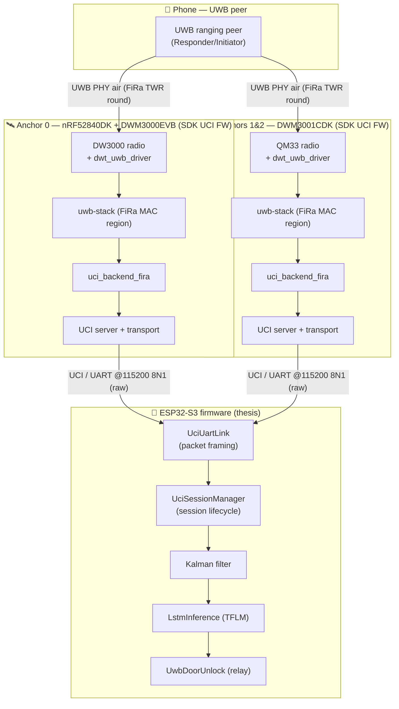
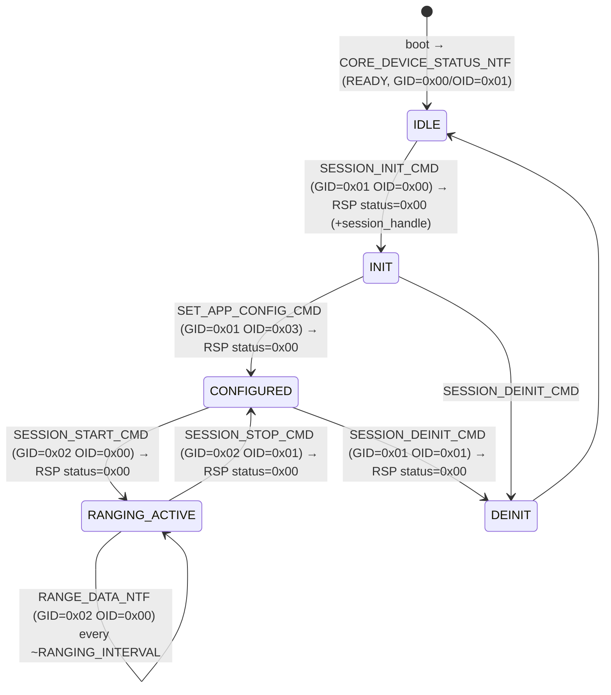

# SDK_ARCHITECTURE.md

> System architecture of DW3_QM33_SDK_1.1.1 as it is consumed by the **ESP32 Smart Car Access**
> thesis (Stage 1 only — single-anchor, 1-D ranging).

---

## 1. High-Level System Diagram



> Transports labelled: **UWB PHY air** = FiRa Two-Way-Ranging exchange; **UCI/UART @115200** = raw
> FiRa UCI packets, 8N1, no flow control (`HAL_uart.c`). SPI (host↔radio) is internal to each anchor
> board and defined in its `platform_l1_config.c` / BSP.

---

## 2. Data Flow — Ranging Packet End-to-End

```
[1] FiRa ranging round on UWB PHY
      Poll → Response → (Final) messages between phone and anchor (DS-TWR when
      RANGING_ROUND_USAGE=2). ToF is computed from the timestamps.               (uwb-stack, air)

[2] DW3000/QM33 hardware captures RX/TX timestamps
      radio IRQ → dwt_uwb_driver → uwb-stack MAC (FiRa region)                    (SDK, ISR/MAC)

[3] uwb-stack assembles the ranging result
      distance (cm), status, per-peer MAC, optional AoA/RSSI                      (SDK, MAC thread)

[4] uci_backend_fira builds RANGE_DATA_NTF
      GID=0x02, OID=0x00; header + measurement block (byte layout §3 of UCI_FLOW) (SDK, UCI task)

[5] UCI transport writes raw bytes to UART0
      reporter_instance.print() → HAL_uart TX @115200                            (SDK)
─────────────────────────────────────────────────────────────────────────────────────────────
[6] ESP32 UciUartLink.poll() decodes the UCI packet
      4-byte header + payload; dispatches to callback                            (thesis fw)

[7] UciSessionManager.onPacket() extracts distance
      gid==0x02 && oid==0x00 → num_meas=payload[24], status=payload[27],
      distance_cm = payload[29] | payload[30]<<8; meters = cm/100 + 0.24         (thesis fw)

[8] Kalman → residual → LSTM → UwbDoorUnlock
      relay-attack classification and door-unlock decision                       (thesis fw)
```

Steps 1–5 are evidenced by SDK source (`uci_transport.c`, `uci_backend_fira.h`, `qorvo_msg.py`,
`HAL_uart.c`). Steps 6–8 are in
[iot/src/uwb/uci_session_manager.cpp](../../SmartCarAccess-main/iot/src/uwb/uci_session_manager.cpp).

---

## 3. UCI Session State Machine



ASCII equivalent:

```
IDLE ──SESSION_INIT(0x01/0x00)──▶ INIT ──SET_APP_CONFIG(0x01/0x03)──▶ CONFIGURED
CONFIGURED ──SESSION_START(0x02/0x00)──▶ RANGING_ACTIVE
RANGING_ACTIVE ──(RANGE_DATA_NTF 0x02/0x00, repeats)──▶ RANGING_ACTIVE
RANGING_ACTIVE ──SESSION_STOP(0x02/0x01)──▶ CONFIGURED
CONFIGURED ──SESSION_DEINIT(0x01/0x01)──▶ DEINIT ──▶ IDLE
```

Every state transition is confirmed by a `SESSION_STATUS_NTF` (GID=0x01 OID=0x02). State names map to
`enum uci_device_state` / FiRa session states.

---

## 4. Module Boundaries

| Module | Owns | Does NOT own |
|--------|------|--------------|
| UCI transport (`uci_transport.c`) | Raw byte framing, header/length assembly, garbage flush | Command semantics, ranging |
| UCI server + backend manager | Command dispatch by GID/OID and session type | UART bytes, MAC timing |
| `uci_backend_fira` | Ranging session control, building `RANGE_DATA_NTF` | UWB PHY timing, filtering |
| uwb-stack FiRa MAC region | Ranging round scheduling, ToF computation | UCI encoding, host policy |
| `dwt_uwb_driver` | Radio register access, TX/RX, timestamps | Session/state logic |
| HAL UART (`HAL_uart.c`) | 115200 8N1 UART bytes in/out | UCI meaning |
| Reporter / Comm | Interface selection (UART vs USB-CDC vs BLE) | Payload content |
| *(host)* `UciSessionManager` | Session sequencing, distance parsing, Kalman/LSTM/door | Any on-anchor logic |

---

## 5. External Dependencies & Connections

| Dependency | Used by | Connection type |
|------------|---------|-----------------|
| FreeRTOS | whole firmware | RTOS scheduler / tasks |
| Nordic nRF5 SDK 17.1 | HAL, BSP, `app_uart` | vendored source |
| SoftDevice S113 | optional BLE transport (`Comm/BLE`) | binary blob |
| Qorvo uwb-stack (`uwbstack_libs`) | UCI backends, MAC | precompiled libs + headers |
| `dwt_uwb_driver` | uwb-stack | C driver, SPI to radio |
| DW3000 / QM33 radio | driver | SPI bus + IRQ + reset GPIO |
| Host (ESP32) | UCI server | UART0 @ 115200 8N1 (raw UCI) |
| J-Link | flashing/debug | SWD |
| `uwb-qorvo-tools` (Python) | bench testing | UCI over UART/USB from a PC |

---

## 6. Runtime / Concurrency Model

- **UCI task** (`uci_task`, priority `PRIO_UciTask`, 6 KB stack): blocks on a FreeRTOS message queue;
  processes `UCI_DATA_IN` items, runs `uci_tp_read()` → UCI core → FiRa backend.
- **UART RX**: interrupt-driven (`deca_uart_event_handle` → `deca_uart_receive`) filling a circular
  buffer; the ISR is minimal and defers work to the UCI task via the queue (ISR-safe boundary).
- **UART TX / output**: notifications are flushed from task context via `reporter_instance.print()`
  (polled/FIFO), not from the ISR.
- **MAC / ranging**: runs in the uwb-stack under the radio IRQ + its own work context; the UCI task
  only consumes assembled results (must be deferred out of ISR into the backend).
- **Garbage/timeout**: partial UCI frames older than 100 ms are flushed to resynchronise the stream.

---

## 7. Differences Between nRF52840DK+DWM3000EVB and DWM3001CDK

| Aspect | nRF52840DK + DWM3000EVB | DWM3001CDK |
|--------|-------------------------|------------|
| SDK / HAL | Same UCI app + uwb-stack | Same |
| SoC | nRF52840 (`nrf52840_xxaa`) | nRF52833 (`nrf52833_xxaa`) |
| UART config | 115200 8N1; TX=P0.06 RX=P0.08 | 115200 8N1; TX=P0.19 RX=P0.15 |
| Default role | Host-driven (Controller/Initiator vs ESP32) | Same |
| Ranging output format | `RANGE_DATA_NTF` identical layout | Identical |
| AoA | No (single antenna) | Optional AoA antenna |
| Extra I/O | DWM3000EVB shield on the DK | Integrated module, onboard J-Link + USB-CDC |
| ESP32 impact | Baseline | Only anchor-side UART pins + unique `DEVICE_MAC` differ; `onPacket()` unchanged |

---

## See also
- [SDK_UCI_FLOW.md](SDK_UCI_FLOW.md) — byte-level UCI protocol
- [SDK_CODEBASE_REFERENCE.md](SDK_CODEBASE_REFERENCE.md) — full onboarding
- [SDK_INTEGRATION_LINK.md](SDK_INTEGRATION_LINK.md) — ESP32 ↔ SDK mapping
