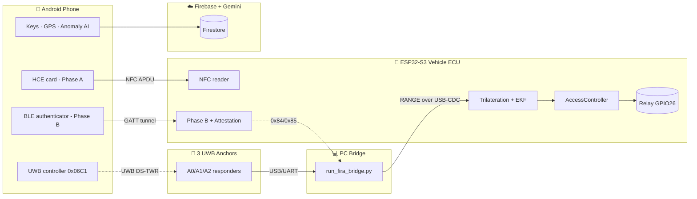

# Smart Car Access — A Multi-Factor Digital Key System with UWB Localization and Edge Intelligence

> **Bachelor/Master Thesis project.** A defense-in-depth, phone-as-key access-control system for
> vehicles, inspired by the Car Connectivity Consortium (CCC) Digital Key Release 3. It couples
> **cryptographic authentication** (NFC + BLE) with **physical proximity verification** (multi-anchor
> Ultra-Wideband localization) and **edge/cloud intelligence** for anomaly detection.
>
> This README is the single, detailed source of truth for the thesis. It is written to be
> transcribed directly into a LaTeX report; section numbering, tables, equations, and diagrams are
> report-ready. Companion design documents live in [docs/](docs).

---

## Table of Contents

1. [Abstract](#1-abstract)
2. [Motivation & Objectives](#2-motivation--objectives)
3. [Background](#3-background)
4. [System Overview](#4-system-overview)
5. [Hardware & Software Stack](#5-hardware--software-stack)
6. [Security Layer 1 — NFC Provisioning (Phase A)](#6-security-layer-1--nfc-provisioning-phase-a)
7. [Security Layer 2 — BLE Authentication (Phase B)](#7-security-layer-2--ble-authentication-phase-b)
8. [Digital-Key Attestation & Sharing](#8-digital-key-attestation--sharing)
9. [Proximity Layer — Multi-Anchor UWB Localization](#9-proximity-layer--multi-anchor-uwb-localization)
10. [Decision Layer — Geometric Access Control](#10-decision-layer--geometric-access-control)
11. [Mobile Application](#11-mobile-application)
12. [Cloud & AI Anomaly Detection](#12-cloud--ai-anomaly-detection)
13. [Firmware Runtime Model](#13-firmware-runtime-model)
14. [Security Analysis & Threat Model](#14-security-analysis--threat-model)
15. [Build, Flash & Run](#15-build-flash--run)
16. [Evaluation Methodology](#16-evaluation-methodology)
17. [Repository Layout](#17-repository-layout)
18. [Limitations & Future Work](#18-limitations--future-work)
19. [Glossary & References](#19-glossary--references)

---

## 1. Abstract

Passive keyless entry systems are convenient but historically vulnerable to **relay attacks**,
where an adversary bridges the radio link between key and car to unlock a vehicle whose owner is
far away. This thesis designs and implements **Smart Car Access**, a phone-as-key system that
raises the bar against such attacks by combining three complementary layers:

1. **Cryptographic identity.** The phone is enrolled to the vehicle over **NFC** (Phase A) using a
   fail-closed provisioning protocol, and authenticates over **BLE** (Phase B) with an
   ephemeral **ECDH + HKDF** handshake and a challenge bound to the vehicle identity. Immobilizer
   secrets never leave the vehicle.
2. **Physical proximity.** Three fixed **Ultra-Wideband (UWB)** anchors perform **double-sided
   two-way ranging (DS-TWR)** against the phone. A PC bridge aggregates the three distances and
   streams them to the vehicle, which computes a planar position via **trilateration** and tracks
   it with a **2-D Kalman filter**, recovering both position and velocity.
3. **Intelligent decision-making.** The vehicle unlocks only when the fused position enters a
   geometric zone around the driver door **while the user is approaching** (radial-velocity gate),
   with hysteresis and consecutive-hit debouncing to prevent spurious actuation. A parallel,
   cloud-assisted anomaly engine on the phone scores each access event by time, location, and
   frequency (optionally enriched by a large language model) to protect key *usage*.

The result is a working end-to-end prototype on an ESP32-S3 vehicle ECU, three DWM3001CDK UWB
anchors, and an Android application, demonstrating that cryptographic authentication and UWB-based
localization can be integrated into a single, layered access-control pipeline suitable for study of
relay-attack resistance.

---

## 2. Motivation & Objectives

### 2.1 Problem

Conventional Passive Keyless Entry and Start (PKES) systems answer only *"is a valid key nearby?"*
via signal presence/RSSI, which a relay can trivially forge. Distance itself must be measured with
a technology that resists relaying. **UWB** provides centimetre-class, time-of-flight ranging that
is hard to shorten, making it the physical-layer anchor for secure proximity.

### 2.2 Objectives

- **O1 — Layered trust.** Combine NFC provisioning, BLE authentication, and UWB proximity so that
  no single spoofed signal grants access.
- **O2 — Local root of trust.** Keep immobilizer tokens and the vehicle private key on the vehicle;
  keep the phone's identity key non-exportable in the Android Keystore.
- **O3 — Real 2-D localization.** Move beyond a single distance to a fused `(x, y)` position and
  velocity, enabling zone- and intent-aware decisions.
- **O4 — Relay-attack study.** Provide the data pipeline, datasets, and tooling to characterize
  normal approach vs. loitering vs. relay behaviour.
- **O5 — End-to-end prototype.** Deliver working firmware, a PC ranging bridge, and a companion app
  with cloud key management.

### 2.3 Contributions

1. A complete, layered digital-key architecture with a clean separation between *authentication*
   (NFC/BLE) and *proximity* (UWB).
2. An on-device **trilateration + EKF** localization pipeline running on a commodity ESP32-S3.
3. A **PC ranging bridge** that turns three commodity UWB anchors into a synchronized 3-distance
   feed, with an explicit start/stop control channel gated by the cryptographic session.
4. A **geometric access-control policy** with an approach-direction gate that rejects pass-by and
   walk-away trajectories.
5. A companion **Android app** with Keystore-backed keys, HCE provisioning, background BLE
   automation, and an independent cloud/AI **access-pattern anomaly** engine.

---

## 3. Background

### 3.1 CCC Digital Key (inspiration)

The CCC Digital Key standard defines phone-as-key using NFC (provisioning/fallback), BLE
(authentication and ranging orchestration), and UWB (secure ranging). This project is *inspired by*
Release 3 concepts — a confidential vehicle **mailbox**, endpoint keys, immobilizer tokens, and an
APDU-style secure tunnel — but is an independent academic implementation, not a certified stack.

### 3.2 Relay attacks

In a relay attack, two colluding devices forward the legitimate key's messages across a long
distance, defeating presence-based entry. Countermeasures require *measuring distance* in a way the
relay cannot shorten. UWB DS-TWR measures round-trip time of flight and is the industry's answer;
this project uses it as the physical gate on top of cryptographic identity.

### 3.3 UWB ranging

**DS-TWR** exchanges timestamped frames between an initiator (controller) and responder(s) and
computes distance from the round-trip minus processing delays, cancelling clock offset. In
**multicast / one-to-many** mode a single controller ranges against several responders in one
round — here, the phone (controller `0x06C1`) ranges against three anchors (responders `0/1/2`).

### 3.4 State estimation

Three distances over-determine a 2-D position, which we solve by **trilateration** (closed-form for
two circles, Gauss-Newton least-squares for three). Because individual fixes are noisy (multipath,
NLOS), a **constant-velocity Kalman filter** fuses successive fixes into a smooth track and
estimates velocity, which the decision layer uses to judge approach direction.

---

## 4. System Overview



**Four domains, four responsibilities:**

| Domain | Role |
|--------|------|
| **Phone** | Digital key holder; NFC card; BLE authenticator; UWB controller; cloud client. |
| **Anchors + PC bridge** | Measure three distances; aggregate and stream them to the vehicle; obey start/stop. |
| **Vehicle ECU** | Root of trust; provisioning reader; BLE peripheral; localization + unlock. |
| **Cloud/AI** | Key metadata, access logs, and access-pattern anomaly scoring. |

The **end-to-end unlock story:** the owner walks up, the phone (running in the background) detects
the vehicle and completes BLE Phase B; the phone then commands ranging to start; the anchors range
against the phone; the PC forwards distances; the ESP32 fuses them into an approaching track; when
the track enters the driver-door zone the relay fires.

---

## 5. Hardware & Software Stack

### 5.1 Hardware

| Component | Part | Role |
|-----------|------|------|
| Vehicle ECU | ESP32-S3 dev board (`yolo_uno`) | BLE peripheral, NFC reader, fusion, relay |
| NFC reader | PN532 (UART/HSU) | Phase A provisioning |
| UWB anchors ×3 | Qorvo DWM3001CDK (DW3xxx/QM33) | DS-TWR responders |
| Phone | Android 16+ (API 36) | Key, HCE, BLE, UWB controller |
| PC | Any host with Python 3.8+ | Ranging bridge |
| Actuator | Relay module on GPIO26 | Door lock/unlock |

### 5.2 Software

| Layer | Technology |
|-------|-----------|
| Firmware | Arduino + PlatformIO, FreeRTOS, NimBLE-Arduino, mbedTLS, PN532, TensorFlowLite_ESP32 (dormant) |
| Bridge | Python, `pyserial`, Qorvo `uci` package |
| App | Flutter/Dart + Kotlin/Java native (HCE, Keystore, `android.ranging`) |
| Cloud | Firebase Auth/Firestore/Storage/FCM; Gemini 2.5 Flash Lite |
| Crypto | ECDSA/ECDH P-256, HKDF-SHA256, HMAC-SHA256, AES |

Firmware build config (`iot/platformio.ini`): native USB-CDC on boot, PN532 over HSU, and
compile-time PKE rollout flags (fast transaction **on**, bonding enforcement **off**, RSSI
monitor-only, advertising fast/slow windows).

---

## 6. Security Layer 1 — NFC Provisioning (Phase A)

**Goal:** bind exactly one owner phone to the vehicle, establishing endpoint keys and an
immobilizer token — fail-closed.

**Roles:** the vehicle is the **NFC reader** (PN532); the phone is an **HCE card**
(`ProvisioningHostApduService.kt`, applet AID `A0 00 00 08 09 43 43 43 44 4B 46 76 31`).

**Flow:**

```
SELECT AID (0xA4) ─ validate CCC applet + response TLVs
SPAKE2+ REQUEST/VERIFY (0x30/0x32) ─ HMAC-SHA256 over the master-card shared secret
GET DATA (0xCA) ─ phone endpoint public key (65 B) + optional cert chain + fast artifact (TLV 0x90/0x91)
WRITE DATA (0xD4) ─ push vehicle_id (TLV 0x80) + vehicle_pub (TLV 0x81) to the phone
Signature proof ─ phone signs the challenge; ECU verifies with the endpoint key
OP CONTROL (0x3C) ─ commit gate; failure aborts persistence
PROVISION RESULT (0xDA) ─ final notify
```

**Security properties:**
- The vehicle validates *content* (TLV tags, MAC), not just `90 00` status words, so stale or
  replayed frames are rejected.
- Reselect recovery tolerates PN532 RF drops without weakening validation (bounded attempts).
- The phone's identity private key is generated in and never leaves the **Android Keystore**
  (alias `smart_car_phone_identity_p256`).
- On success the vehicle activates **slot 0** (owner) and ensures a 32-byte **immobilizer token**
  exists — the local root of trust for future key sharing.

The confidential result is stored in the **CCC Mailbox** (NVS namespace `ccc_dk`): `vehicle_id`,
`vehicle_pub/priv`, `slot_bitmap`, per-slot `endpoint_pub`/`immobilizer_token`, the versioned
**fast artifact**, and force-provisioning flags.

---

## 7. Security Layer 2 — BLE Authentication (Phase B)

**Goal:** prove the phone owns the enrolled key and derive an encrypted session, over an
APDU-style tunnel on GATT service `0000aaaa…` (RX `0000aac1` write, TX `0000aac2` notify).

**Instruction set (INS byte):**

| INS | Name | Purpose |
|-----|------|---------|
| `0x80` | AUTH0 | Start; ECU returns an ephemeral P-256 public key (P1 `0x11` standard, `0x01` fast) |
| `0x81` | AUTH1 | Phone ephemeral key + signature; ECU verifies with the stored endpoint key |
| `0x82` | EXCHANGE | Challenge signature; optional epoch **time-sync** (P1 `0x10`) |
| `0x83` | CONTROL_FLOW | Unlock / secure command path (requires session) |
| `0x84` | RANGING_START | Start UWB ranging (requires session) |
| `0x85` | RANGING_STOP | Stop UWB ranging (requires session) |

**Handshake:**

$$
\text{ECDH: } S = d_{\text{ECU}} \cdot Q_{\text{phone}}
\qquad
(K_{\text{enc}}, K_{\text{mac}}) = \text{HKDF-SHA256}(S,\; \text{info})
$$

where $\text{info} = \texttt{"SmartCarv1|ENC/MAC"} \,\Vert\, \text{pub}_{\text{ECU}} \,\Vert\, \text{pub}_{\text{phone}}$.
The challenge is $\text{vehicleId}(8) \Vert \text{nonce}(16)$, signed by the phone and verified by
the ECU. A **fast path** (AUTH0 P1 `0x01`) derives session keys from a pre-shared, versioned *fast
artifact* to skip ECDH on repeat unlocks, cutting latency.

**Session gating:** ranging (`0x84/0x85`) and control flow (`0x83`) are refused unless
`session_keys_ready` — i.e. UWB proximity can only run *after* cryptographic authentication.

The firmware also records fine-grained **latency telemetry** (`[AUTH-LAT]`) from connect →
AUTH0 → AUTH1 → verified → control-flow-ack, useful for the report's timing analysis.

---

## 8. Digital-Key Attestation & Sharing

A dedicated **attestation service** (`555a0001…`) accepts a 147-byte payload:
`vehicleId(8) ‖ slot(1) ‖ friendPub(65) ‖ validFrom(4) ‖ validUntil(4) ‖ entitlement(1) ‖ sigR(32) ‖ sigS(32)`.
The ECU verifies the ECDSA-P256 signature over the payload prefix with the **owner** public key and
checks the time bounds (2020–2100).

**Sharing status:** owner attestation works; **friend slots 1–7 are verified but disabled by
policy** (owner-only gate, `ERR_SLOT_LOCKED`). Token-MAC binding for share payloads is future work
(see [KNOWN_ISSUES.md](docs/KNOWN_ISSUES.md) #10).

---

## 9. Proximity Layer — Multi-Anchor UWB Localization

This is the layer that turns "a key is near" into "the key is *here*, moving *this way*." It is the
part of the workflow that changed most from the earlier single-distance design.

### 9.1 Ranging topology

```
Phone (controller 0x06C1)  ── UWB DS-TWR (multicast) ──▶  Anchor0/1/2 (responders, mac 0/1/2)
Anchor0/1/2  ── USB/UART (one COM each) ──▶  PC  (run_fira_bridge.py)
PC  ── "RANGE:d0=..,d1=..,d2=..,valid=0|1" over USB-CDC ──▶  ESP32-S3 (UwbBridge)
ESP32-S3  ── "CMD:START_RANGING" / "CMD:STOP_RANGING" ──▶  PC  (replied with "ACK:...")
```

Anchor sessions use FiRa **DS-TWR (deferred)**, channel 9, preamble index 9, controlee/responder
role, one-to-many mode. Each anchor reports its distance to the phone; the PC collects the three
into one frame.

### 9.2 PC bridge (`run_fira_bridge.py`)

- Opens one serial port per anchor plus the ESP32 port; DTR/RTS are held low so the native USB-CDC
  does not reset the ESP32.
- A per-anchor, thread-safe `AnchorState` stores the latest `(distance, timestamp)`.
- The forward loop emits `RANGE:d0,d1,d2,valid` at `--rate-hz` (default 10 Hz), where **`valid=1`
  only when all three readings are fresh** (`≤ --fresh-ms`, default 500) and within
  `[--dmin, --dmax]` (default 0.1–30 m).
- A reader thread obeys `CMD:START_RANGING` / `CMD:STOP_RANGING` and replies `ACK:`.
- The vehicle only issues those commands after Phase B, so **ranging cannot start without a valid
  session**.

### 9.3 Trilateration (`trilateration.cpp`)

With anchors at $a_i = (a_{ix}, a_{iy})$ and measured distances $d_i$:

- **Two valid anchors:** closed-form two-circle intersection (with a line-projection fallback when
  circles do not intersect).
- **Three valid anchors:** weighted-centroid seed, then up to 10 **Gauss-Newton** iterations
  minimizing

$$
J(p) = \sum_{i} \big(\lVert p - a_i \rVert - d_i\big)^2 .
$$

The **residual RMS** is returned as a fix-quality metric and feeds the filter's measurement noise.
Reference layout (car frame): $A_0=(0,2)$, $A_1=(-0.85,0)$, $A_2=(0,-2)$ m.

### 9.4 Kalman tracking (`ekf_stub.cpp`)

A 2-D **constant-velocity** filter with state $x = [p_x, p_y, v_x, v_y]^\top$:

$$
x_{k} = F\,x_{k-1},\quad
F = \begin{bmatrix} 1 & 0 & \Delta t & 0 \\ 0 & 1 & 0 & \Delta t \\ 0 & 0 & 1 & 0 \\ 0 & 0 & 0 & 1 \end{bmatrix},\quad
z_k = \begin{bmatrix} p_x \\ p_y \end{bmatrix} + \nu_k .
$$

Process noise uses a white-noise-acceleration model with $\sigma_a = 1.2\ \text{m/s}^2$;
measurement noise $R = \sigma^2$ takes $\sigma$ from the trilateration RMS, clamped to
$[0.05, 1.0]$ m — noisy fixes are trusted less. The filter is driven at **10 Hz**
(`kDrivePeriodMs = 100`); when a `RANGE` frame is dropped, `predictTo()` coasts the estimate
forward (up to a 2 s gap) so the decision layer keeps running smoothly. Clock glitches or long gaps
reinitialize the track.

### 9.5 Serial instrumentation

Each stage logs a line for offline analysis and the real-time visualizer:
`[RANGE3]` (raw distances), `[POS2D]` (trilateration `x,y,rms`), `[EKF]` (fused `x,y,vx,vy,speed`),
`[DOOR]` (decision events).

---

## 10. Decision Layer — Geometric Access Control

`access_controller.cpp` converts the fused track into a relay decision using distance hysteresis
**and** approach direction.

Let the unlock point be $p_u = (-0.85, 0)$ (driver door), $d = \lVert p - p_u \rVert$, and the
**radial velocity**

$$
v_r = \frac{v \cdot (p - p_u)}{d}\quad (v_r>0 \Rightarrow \text{moving away}).
$$

Policy each cycle (10 Hz):

1. **Re-arm:** if $d > 3.0$ m (`RESET_RADIUS_M`) → clear the unlocked latch and hit counter.
2. **Idle when unlocked:** if already unlocked and near → do nothing.
3. **Approach gate:** if $v_r > 0.10$ m/s (moving away / passing by) → reset the hit counter
   (blocks pass-by and walk-away trajectories).
4. **Accumulate & fire:** if $d \le 2.0$ m (`UNLOCK_RADIUS_M`) → increment the consecutive-hit
   counter; after **3** in-zone hits (`REQUIRED_CONSECUTIVE_HITS`) → pulse the relay (GPIO26,
   500 ms) and latch *unlocked*.

The hysteresis (2 m unlock vs. 3 m re-arm) prevents relay chatter at the boundary; the
consecutive-hit debounce rejects single-frame outliers.

> **Note on the LSTM.** An earlier design gated the door with a 1-D LSTM
> (`walk/loiter/attack`). That model (`lstm_inference.cpp`, `uwb_lstm_model.h`) is **retained but
> dormant** — it is not called by the current pipeline. Learned **CNN-LSTM intent recognition** on
> `[x, y, vx, vy]` trajectories is the next milestone (see §18 and
> [STAGE2_PLAN.md](docs/STAGE2_PLAN.md)).

---

## 11. Mobile Application

Flutter/Dart UI over Kotlin/Java native modules.

### 11.1 Services (`lib/service/`)

| Service | Responsibility |
|---------|----------------|
| `pke_auth_orchestrator.dart` | BLE Phase B: scan → connect → authenticate, retry/backoff, fast-transaction, preferred-device quick auth |
| `uwb_multi_service.dart` | Phone-side UWB via native `android.ranging` (multicast DS-TWR, `0x06C1`); streams `d0/d1/d2/mask` |
| `master_card_provisioning.dart` | Read master card NDEF `{vid, msk}` → activate HCE provisioning session |
| `gps_service.dart` | Capture GPS, pack to 32 B, encrypt with session keys + HMAC-SHA256, BLE-send, 30 s auto-sync |
| `anomaly_detection_service.dart` + `ai_service.dart` | Access-pattern anomaly (time/location/frequency) + Gemini enrichment |
| `pke_background_service.dart` | Foreground service: continuous BLE scan, auto Phase B, UWB handoff, Doze exemption |
| `car_service.dart` | Firestore `cars` / `digital_keys` / provisioning records |
| `notification_service.dart`, `language_service.dart` | Localized (EN/VI) alerts and UI |

### 11.2 Native modules (`android/.../`)

| Module | Responsibility |
|--------|----------------|
| `ProvisioningHostApduService.kt` | HCE Phase A applet (SELECT/GET/WRITE/SPAKE2/OP-CONTROL/RESULT) |
| `KeystoreBridge.kt` | Android Keystore identity key (P-256), sign/verify, public-key export |
| `PhaseBCrypto.kt` + `HandshakeChannel.kt` | Ephemeral keypair, ECDH, HKDF, ECDSA over the Flutter MethodChannel |
| `UwbMulticastBridge.kt` | `android.ranging` session lifecycle + result event stream |
| `DataStoreUtil.kt` | Device UID, provisioning binding, fast artifact persistence |

### 11.3 Screens

Dashboard (cars/keys, permissions, Doze), Master-card flow (Phase A), BLE+UWB flow (Phase B →
ranging), Location (encrypted GPS sync), Notifications (anomaly alerts), AI test harness, Settings
(language, background toggle), plus auth screens.

---

## 12. Cloud & AI Anomaly Detection

The app's anomaly engine is **independent of the physical relay** and protects key *usage*:

- **Rule-based scorers:** time (unusual hour/weekday), location (distance from historical access,
  impossible-travel), and frequency (accesses/hour).
- **AI enrichment:** `ai_service.dart` calls **Gemini 2.5 Flash Lite** with the event features and
  returns a risk assessment, recommended action, and human-readable reason.
- **Decision:** combined score → `ALLOW` (low), `CONFIRM` (medium, require user approval), or
  `BLOCK` (high), surfaced as localized push/local notifications and logged to Firestore.

Firebase stores accounts, cars, digital keys, provisioning records, and access logs — **never**
immobilizer tokens or private keys.

---

## 13. Firmware Runtime Model

Three FreeRTOS tasks (pinned to core 1) plus the Arduino loop (`iot/src/main.cpp`):

| Task | Priority | Stack | Role |
|------|----------|-------|------|
| `FSM` | 6 | 8 KB | State machine tick |
| `UWB` | 5 | 20 KB | Read USB-CDC `RANGE`/`ACK`; `UwbBridge::tick()`; `AccessController::tick()` |
| `NFC` | 4 | 8 KB | PN532 polling |
| `loop()` | — | — | BLE housekeeping (50 ms) |

The UWB task outranks NFC so ranging frames are not starved by NFC polling. A central **FSM**
(`fsm/*.cpp`) orchestrates provisioning/auth/unlock/admin/error states; subsystems post events via
`FSMIntegration::{NFC,BLE,Unlock}` hooks, keeping modules loosely coupled.

---

## 14. Security Analysis & Threat Model

| Threat | Mitigation |
|--------|-----------|
| **Relay attack (fake proximity)** | UWB DS-TWR time-of-flight ranging + EKF + approach gate; distance cannot be shortened by relaying RSSI/BLE. |
| **Unauthorized unlock (no valid key)** | Ranging and control flow refused until Phase B session keys exist; relay actuation is local to the ECU. |
| **Replay / stale frames (Phase A)** | Content (TLV/MAC) validation, not just status words; bounded reselect. |
| **Key theft** | Phone identity key is non-exportable (Android Keystore); vehicle private key + tokens stay in NVS. |
| **Cloud compromise** | Cloud holds metadata/logs only; no secrets that can unlock the car. |
| **Abnormal key usage** | App-side time/location/frequency + AI anomaly scoring (CONFIRM/BLOCK). |

**Trust boundaries.** Vehicle = root of trust (tokens, `v_priv`). Phone = holder of a
non-exportable identity key. PC bridge = untrusted transport carrying raw distances only; it cannot
unlock without a BLE session. Cloud = untrusted for unlock decisions.

**Residual risks** (full list in [KNOWN_ISSUES.md](docs/KNOWN_ISSUES.md)): the PC bridge is a
research-grade transport; no continuous re-attestation during a ranging session; no enforced
trusted time source; debug/admin bypasses must be disabled for deployment.

---

## 15. Build, Flash & Run

### 15.1 Firmware (ESP32-S3)

```powershell
cd iot
platformio run                     # build
platformio run --target upload     # flash
platformio device monitor          # serial monitor (115200)
```

### 15.2 UWB ranging bridge (PC)

Run the bridge from the Qorvo SDK tools, pointing it at the three anchor COM ports and the ESP32
USB-CDC port:

```powershell
cd DW3_QM33_SDK_1.1.1\SDK\Tools\uwb-qorvo-tools\scripts\fira\run_fira_twr
python run_fira_bridge.py -p COM11 COM19 COM12 --esp-port COM20 --rate-hz 10
# add --esp-debug to echo the ESP32's FSM/BLE/AUTH diagnostics
```

The bridge waits for `CMD:START_RANGING` from the vehicle (which the phone triggers over BLE after
Phase B) unless `--autostart` is given for bench testing.

### 15.3 Android app

```bash
cd software/smart_car_app
flutter pub get
# place google-services.json in android/app/ ; enable Auth + Firestore in Firebase
flutter run           # or: flutter build apk --release
```

### 15.4 Analysis / visualization tools (`iot/tools/`)

```powershell
cd iot\tools
pip install -r requirements.txt
python realtime_lstm_visualizer.py --port COM20          # live plots (raw/filtered/decision)
python serial_csv_logger.py --port COM20 --label 0 --run 1   # capture labelled dataset
python analyze_ekf.py --log capture.txt --axis X --mode metrics   # EKF noise/tuning analysis
```

---

## 16. Evaluation Methodology

Suggested experiments for the report (each captured to CSV and/or exported to PDF/SVG):

### 16.1 Localization accuracy
- Place the phone at surveyed grid points; log `[POS2D]`/`[EKF]`; report position error
  distribution, RMS, and 95th-percentile.
- Compare raw trilateration vs. EKF-smoothed tracks (use `analyze_ekf.py --mode trajectory`).
- Sweep `kAccelStd` (`analyze_ekf.py --mode sweep`) to justify the chosen process noise.

### 16.2 Unlock behaviour (cause → effect)
Capture three canonical scenarios and correlate signals with the decision:

| Scenario | Expected signature | Decision |
|----------|--------------------|----------|
| **Normal approach** | $d$ decreases smoothly, $v_r<0$ | relay fires after 3 in-zone hits |
| **Pass-by** | enters/leaves zone, $v_r$ crosses 0 | no unlock (approach gate) |
| **Walk-away / loiter** | $d$ oscillates near 2–3 m | no unlock (re-arm/hysteresis) |

### 16.3 Relay-attack characterization
Use the labelled datasets `uwb_lstm_data_label{0,1,2}.csv` (normal / loiter / relay;
columns `run_id, timestamp_ms, raw_m, filtered_m, residual_m, label`) to study residual/velocity
signatures — the basis for the future CNN-LSTM classifier.

### 16.4 Latency
Read `[AUTH-LAT]` counters for connect→unlock timing, and compare the standard vs. fast Phase B
path.

### 16.5 Metrics to report
Position RMS/percentiles; unlock true-positive vs. false-positive rate across scenarios; Phase B
latency (standard vs. fast); ranging frame rate and drop tolerance.

---

## 17. Repository Layout

```
SmartCarAccess/
├─ README.md                       ← this document
├─ PHASE_A_AND_PHASE_B.md          ← NFC + BLE protocol deep dive
├─ UX_UI_IMPROVEMENTS.md           ← app UI changelog
├─ docs/                           ← design documentation set
│  ├─ ARCHITECTURE.md · CODEBASE_REFERENCE.md · API_REFERENCE.md
│  ├─ DATA_CONTRACTS.md · FEATURES.md · GLOSSARY.md
│  ├─ KNOWN_ISSUES.md · STAGE2_PLAN.md
├─ iot/                            ← ESP32-S3 firmware (PlatformIO)
│  ├─ src/  include/               ← ccc_mailbox, nfc_session, provisioning, ble/, fsm/, uwb/
│  ├─ tools/                       ← Python: bridge companions, logger, visualizer, EKF analysis
│  ├─ uwb_lstm_data_label{0,1,2}.csv
│  ├─ IMPLEMENTATION_SUMMARY.md · PAPER.md
│  └─ platformio.ini
└─ software/smart_car_app/         ← Flutter Android app (lib/ + android/ native)

# UWB ranging bridge (outside this folder, in the Qorvo SDK tools):
DW3_QM33_SDK_1.1.1/SDK/Tools/uwb-qorvo-tools/scripts/fira/run_fira_twr/run_fira_bridge.py
```

Related documents: [docs/ARCHITECTURE.md](docs/ARCHITECTURE.md),
[docs/CODEBASE_REFERENCE.md](docs/CODEBASE_REFERENCE.md),
[docs/API_REFERENCE.md](docs/API_REFERENCE.md),
[docs/DATA_CONTRACTS.md](docs/DATA_CONTRACTS.md),
[docs/FEATURES.md](docs/FEATURES.md),
[docs/KNOWN_ISSUES.md](docs/KNOWN_ISSUES.md),
[docs/STAGE2_PLAN.md](docs/STAGE2_PLAN.md),
[PHASE_A_AND_PHASE_B.md](PHASE_A_AND_PHASE_B.md).

---

## 18. Limitations & Future Work

**Current limitations** (see [docs/KNOWN_ISSUES.md](docs/KNOWN_ISSUES.md) for the full list):
- UWB distances reach the vehicle via a **PC bridge** (research transport), not an on-board radio.
- Unlock is **purely geometric**; no learned intent classifier is wired in yet.
- **Friend key sharing** (slots 1–7) is verified but disabled by policy.
- No enforced **trusted time source**; anchor geometry and unlock constants are hard-coded.

**Future work / roadmap** ([docs/STAGE2_PLAN.md](docs/STAGE2_PLAN.md)):
1. **CNN-LSTM intent recognition** (M5/M6) on `[x, y, vx, vy]` windows via TFLM
   (approach / pass-by / anomaly), replacing the dormant 1-D LSTM.
2. **Geofenced multi-zone actuation** (M7/M8): Welcome, Driver Door, Trunk, Cabin, each gated by
   the session and the classifier.
3. On-board UWB (remove the PC bridge) for a production topology.
4. Enable friend sharing with token-MAC-bound attestations and slot lifecycle management.
5. Adaptive EKF/anchor-geometry (GDOP-aware) tuning and field calibration.

---

## 19. Glossary & References

- **Glossary:** see [docs/GLOSSARY.md](docs/GLOSSARY.md) for all terms (CCC, DS-TWR, HCE, EKF,
  trilateration, immobilizer token, fast artifact, radial velocity, GDOP, etc.).
- **CCC Digital Key** — Car Connectivity Consortium, Digital Key specification (Release 3) —
  conceptual inspiration only; this project is an independent academic implementation.
- **FiRa Consortium** — UWB PHY/MAC and UCI profiles used by the DWM3001CDK anchors.
- **Qorvo DW3xxx / QM33** — UWB transceiver and SDK (`DW3_QM33_SDK_1.1.1`).
- **NIST SP 800-56A / RFC 5869** — ECDH key agreement and HKDF, as used for session-key derivation.

---

*Security reminders:* immobilizer tokens and the vehicle private key never leave the ESP32; the
phone identity key stays in the Android Keystore; the cloud never stores unlock secrets; and all
debug/admin bypasses must be disabled before any real-world deployment.
