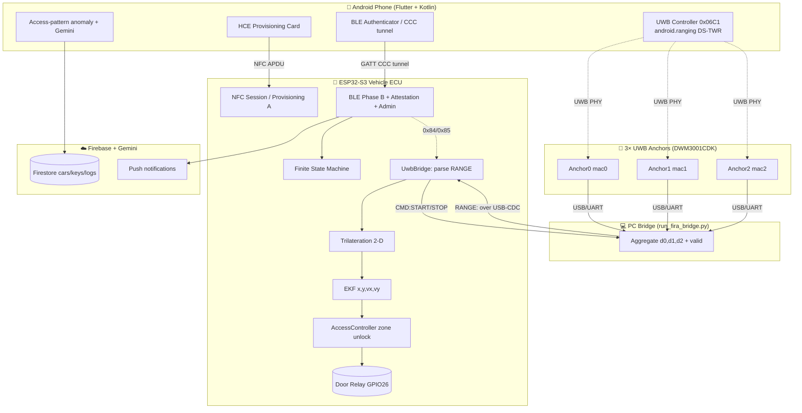
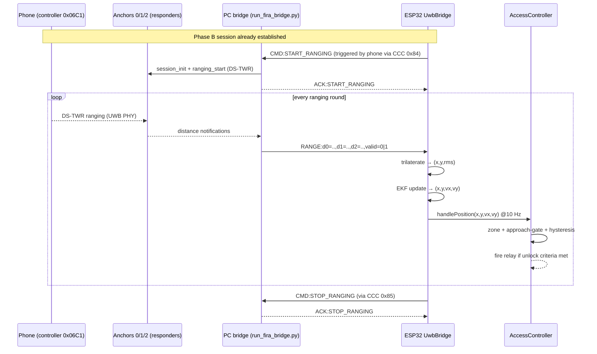

# ARCHITECTURE.md

High-level system design for **Smart Car Access** — a multi-factor, multi-transport digital
key system inspired by the Car Connectivity Consortium (CCC) Digital Key Release 3.

> Last updated: 2026-09-02. This document reflects the **multi-anchor UWB** architecture:
> UWB ranging is now collected by a PC bridge and fused on the ESP32 into a 2-D position via
> trilateration + Extended Kalman Filter (EKF), which drives a geometric door-unlock policy.
> The former single-anchor 1-D pipeline (`uci_session_manager`, `uci_door_unlock`, ESP-NOW
> C3 bridges, BLE OOB) has been removed.

---

## 1. System Overview

The system spans four cooperating domains:

| Domain | Hardware / Runtime | Responsibility |
|--------|--------------------|----------------|
| **Vehicle** | ESP32-S3 (`yolo_uno`), PN532 NFC, door relay | Root of trust, provisioning reader, BLE peripheral, position fusion + unlock actuation |
| **Ranging bridge** | PC (Python) + 3× UWB anchors (DWM3001CDK) | Multi-anchor DS-TWR ranging, distance aggregation, USB-CDC transport to the vehicle |
| **Phone** | Android (Flutter + Kotlin native) | Digital key holder, HCE provisioning card, BLE authenticator, UWB controller, cloud client |
| **Cloud** | Firebase (Auth, Firestore, Storage, FCM) + Gemini API | Account/key metadata, access logs, AI access-pattern anomaly scoring |



---

## 2. Data Flows

### 2.1 Provisioning — Phase A (NFC)

Binds one owner phone to the vehicle. The vehicle acts as the **NFC reader** (PN532), the phone
acts as an **HCE card** (`ProvisioningHostApduService.kt`). Fail-closed: the vehicle validates
payload content (TLV tags), not just status words.

```
Owner taps phone ─▶ PN532 polls ISO14443A ─▶ SELECT AID (CCC applet)
   ─▶ SPAKE2+ challenge/response (HMAC over shared master secret from master card)
   ─▶ GET DATA (phone endpoint public key + optional cert chain + fast artifact)
   ─▶ WRITE DATA (vehicle_id 0x80 + vehicle_pub 0x81 pushed to phone)
   ─▶ Signature proof (phone signs challenge, ESP verifies with endpoint key)
   ─▶ OP CONTROL commit gate ─▶ persist owner slot 0 + ensure immobilizer token
```

### 2.2 Authentication — Phase B (BLE, CCC tunnel)

Proves the phone owns the enrolled identity key and establishes an encrypted session over an
APDU-like tunnel (GATT service `0000aaaa…`, RX `0000aac1`, TX `0000aac2`).

```
AUTH0 (0x80) ─▶ ECU ephemeral P-256 keypair (+ vehicle-key signature)
AUTH1 (0x81) ─▶ phone ephemeral key + signature ─▶ ECU verifies with stored endpoint key
             ─▶ ECDH shared secret ─▶ HKDF-SHA256 → session ENC + MAC keys
EXCHANGE (0x82) ─▶ challenge = vehicleId(8)‖nonce(16); phone signs; ECU verifies
                   (optional epoch time-sync payload)
CONTROL_FLOW (0x83) ─▶ unlock decision / secure command path
Fast path: AUTH0 P1=0x01 uses a pre-shared "fast artifact" to skip ECDH.
```

### 2.3 Proximity — Multi-anchor UWB → 2-D position → unlock

This is the workflow that changed most. There is **no direct radio on the ESP32**; ranging is
performed between the phone (UWB controller) and 3 anchors, aggregated by a PC, and streamed to
the vehicle as text frames over USB-CDC.



`valid=1` only when **all three** anchor readings are fresh (`≤ fresh_ms`) and within
`[dmin, dmax]`. The ESP32 only trilaterates frames with a non-zero validity mask.

### 2.4 App-side access-pattern anomaly (independent)

Separate from the firmware relay-attack analysis. The Flutter app scores each access event by
**time, location, and frequency**, optionally enriched by **Gemini 2.5 Flash Lite**, producing
`ALLOW / CONFIRM / BLOCK` decisions and localized push notifications. This does **not** gate the
physical relay; it protects the app/cloud key-usage surface.

---

## 3. Module Ownership & Boundaries

| Module | Location | Owns |
|--------|----------|------|
| CCC Mailbox | `iot/src/ccc_mailbox.cpp` | Vehicle identity, keys, slots, tokens, fast artifact (NVS `ccc_dk`) |
| NFC Session / Provisioning | `iot/src/nfc_session.cpp`, `provisioning_phase.cpp` | Phase A reader + persistence + fail-closed validation |
| BLE | `iot/src/ble/*.cpp` | Phase B auth, attestation, admin, echo, telemetry, advertising rollout |
| FSM | `iot/src/fsm/*.cpp` | State orchestration + integration hooks between subsystems |
| UWB Bridge | `iot/src/uwb/uwb_bridge.cpp` | Parse RANGE/ACK frames, drive fusion at fixed cadence, issue CMD |
| Trilateration | `iot/src/uwb/trilateration.cpp` | 3-circle intersection / Gauss-Newton LS → `(x, y, rms)` |
| EKF | `iot/src/uwb/ekf_stub.cpp` | 2-D constant-velocity Kalman filter `[x, y, vx, vy]` |
| Access Controller | `iot/src/uwb/access_controller.cpp` | Geometric zone unlock + relay actuation |
| LSTM (dormant) | `iot/src/uwb/lstm_inference.cpp` | Retained TFLM model, **not wired** into current pipeline |
| PC Bridge | `DW3_QM33_SDK.../scripts/fira/run_fira_twr/run_fira_bridge.py` | Anchor session lifecycle, distance forwarding, CMD handling |
| Flutter services | `software/smart_car_app/lib/service/*.dart` | Auth, keys, BLE, UWB, GPS, anomaly, background |
| Android native | `software/smart_car_app/android/.../*.kt` | HCE applet, Keystore, Phase B crypto, UWB bridge |

---

## 4. Runtime & Concurrency (ESP32)

Three FreeRTOS tasks pinned to core 1, plus the Arduino loop for BLE housekeeping
(`iot/src/main.cpp`):

| Task | Priority | Stack | Role |
|------|----------|-------|------|
| `FSM` | 6 | 8 KB | `FSM::tick()` state machine |
| `UWB` | 5 | 20 KB | Read USB-CDC RANGE/ACK, `UwbBridge::tick()`, `AccessController::tick()` |
| `NFC` | 4 | 8 KB | `NfcSession::tick()` PN532 polling |
| `loop()` | — | — | `BLEMod::tick()` every 50 ms |

The UWB task is placed above NFC so RANGE frames are not starved by NFC polling. The EKF is
driven at a fixed **10 Hz** (`kDrivePeriodMs = 100`), decoupled from the raw RANGE rate so unlock
debounce timing stays consistent and prediction bridges dropped frames (up to `kMaxGapS = 2 s`).

---

## 5. External Dependencies & Hardware

| Dependency | Where | Purpose |
|------------|-------|---------|
| NimBLE-Arduino | firmware | GATT peripheral |
| PN532 | firmware | NFC reader (HSU/UART) |
| TensorFlowLite_ESP32 | firmware | Dormant on-device inference runtime |
| mbedTLS | firmware | ECDSA/ECDH/HKDF/HMAC (P-256) |
| `pyserial`, `numpy`, `matplotlib` | PC tools | Bridge + analysis/visualization |
| Qorvo `uci` package | PC bridge | FiRa/UCI anchor control |
| Firebase (Auth/Firestore/Storage/FCM) | app | Accounts, key metadata, logs, notifications |
| Gemini 2.5 Flash Lite | app | Access-pattern anomaly enrichment |
| Android Keystore | app native | Non-exportable identity private key (P-256) |
| `android.ranging` (API 36+) | app native | Phone-side UWB controller (multicast DS-TWR) |

**Physical connections**

```
Phone ──(NFC)──▶ PN532 ──(UART HSU)──▶ ESP32-S3
Phone ──(BLE GATT)──▶ ESP32-S3
Phone ──(UWB PHY, DS-TWR)──▶ Anchor0/1/2
Anchor0/1/2 ──(USB/UART, one COM each)──▶ PC
PC ──(USB-CDC serial)──▶ ESP32-S3
ESP32-S3 ──(GPIO26)──▶ Door relay
```

---

## 6. Trust Boundaries

- **Vehicle (ESP32)** — root of trust for immobilizer tokens and the vehicle private key
  (`v_priv`, NVS). Trusts only cryptographically verifiable data; unlock actuation is local.
- **Phone** — holds its identity private key in Android Keystore (non-exportable). Cannot mint
  immobilizer tokens.
- **PC bridge** — a transport/aggregation convenience for research. It carries **raw distances
  only**; it does not hold keys and cannot unlock the vehicle without a valid BLE session
  (ranging start/stop is gated by `s_session_keys_ready`).
- **Cloud** — untrusted for unlock decisions; stores metadata/logs only, never immobilizer tokens.

See [KNOWN_ISSUES.md](KNOWN_ISSUES.md) for the residual risks of the current research-grade
transport, and [STAGE2_PLAN.md](STAGE2_PLAN.md) for the roadmap toward on-device intent
recognition and geofenced actuation.
