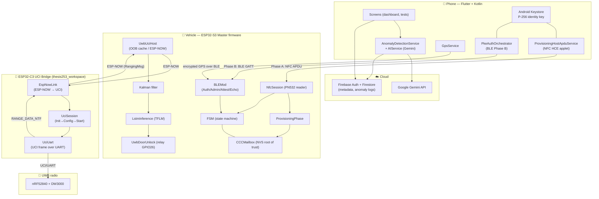

# ARCHITECTURE.md

System architecture for the **ESP32 Smart Car Access** digital-key platform (CCC Release 3 inspired).

---

## 1. High-Level System Diagram



---

## 2. Data Flow (Input → Output)

### 2.1 Provisioning (Phase A, NFC)
```
Phone HCE applet ──NFC APDU──▶ PN532 ──▶ NfcSession.tick()
  SELECT AID (A000000809434343444B467631)
  → SPAKE2+ shell (HMAC verify)
  → GET DATA (phone endpoint key ep_PK)
  → WRITE DATA (vehicle v_pub)
  → signature proof (phone signs challenge, ESP32 verifies with ep_PK)
  → OP CONTROL commit gate
  → ProvisioningPhase.setOwnerProvisioned() → CCCMailbox slot 0 + tok_0 (NVS)
```

### 2.2 Authentication (Phase B, BLE)
```
PkeAuthOrchestrator ──GATT──▶ BLEAuth (service 0000aaaa-…)
  0x80 Auth0    : exchange ephemeral public keys
  0x81 Auth1    : phone sends identity-signed ephemeral key; ESP32 returns its ephemeral
  ECDH(P-256)   : derive shared secret
  0x82 Exchange : HKDF-SHA256 → session_enc_key[32] + session_mac_key[32]
  0x83 ControlFlow : challenge-response bound to v_id → session ready
  → GPS packets (AES/HMAC) flow over encrypted channel
```

### 2.3 Proximity + AI decision (UWB via ESP32-C3 Bridge)

```
Phone ──BLE(OOB)──▶ UwbUciHost.submitBleOob()
  → parse OOB → map to UciRunConfig → cache
  → on requestStart(): send StartSession over ESP-NOW to ESP32-C3 Bridge

ESP32-C3 Bridge ──UCI/UART──▶ DW3000 (nRF52840DK)
  SESSION_INIT → SET_APP_CONFIG → RANGING_START
  ← RANGE_DATA_NTF (status + distance_cm)

ESP32-C3 Bridge ──ESP-NOW(RangingMsg)──▶ Master tick()
  → parse dist(cm) → +antenna offset 0.24m → sanity[-1..30m]
  → Kalman.getFilteredValue() → residual = raw - filtered
  → velocity = Δfiltered/Δt
  → LstmInference.predict() → p_walk / p_loiter / p_attack
  → UwbDoorUnlock.handleRangingWithAI(dist, p...)
      accept: dist ≤ 2.0m AND p_walk > 0.80 (×3 consecutive) → relay pulse (GPIO26, 500ms)
      reject: p_attack > 0.70 → relay disabled
```

### 2.4 App-side anomaly pipeline
```
AccessEvent → AnomalyDetectionService.analyzeAccessEventWithAI()
  → preprocess (hour, weekday, distanceFromUsual, accessCountLastHour)
  → AIService.detectAnomalyWithAI() → Gemini (fallback: rule-based)
  → AnomalyEnrichedDecision {severity, action, shouldNotify}
  → Firestore(anomaly_analysis) + push notification (medium/high)
```

---

## 3. Module Boundaries (Owns / Does NOT own)

| Module | Owns | Does NOT own |
|--------|------|--------------|
| `CCCMailbox` | Vehicle identity, slots, tokens, NVS persistence, vehicle signing | Transport (NFC/BLE), unlock decision |
| `NfcSession` / `ProvisioningPhase` | Phase A APDU loop, phone-key persistence, signature verify | Session keys, UWB, relay |
| `BLEMod` / `BLEAuth` | GATT services, Phase B handshake, session keys, GPS decrypt | Physical proximity, relay firing |
| `FSM` | State/event orchestration, transition validation | Crypto primitives, hardware I/O (delegates) |
| `UwbUciHost` (master only) | OOB parsing, ESP-NOW to C3 bridges, ranging-data consumption | UCI framing, relay GPIO |
| `EspNowLink` / `UciSession` / `UciUart` (C3 bridge) | ESP-NOW receive, UCI session lifecycle, UCI framing over UART, ranging data send-back | Cryptographic auth, AI inference, door policy |
| `LstmInference` | Sliding window, normalization, TFLM inference | Distance acquisition, unlock policy |
| `UwbDoorUnlock` | Hysteresis, AI-gated relay policy, GPIO26 | Distance filtering, AI model |
| App `PkeAuthOrchestrator` | Phone-side BLE handshake, session keys | Immobilizer tokens, relay |
| App `GpsService` | Location capture, 32-byte packet, HMAC | Transport, decryption on vehicle |
| App `AnomalyDetectionService` | Access-pattern scoring, notifications | Physical unlock, immobilizer trust |
| Kotlin `KeystoreBridge`/`PhaseBCrypto` | P-256 keys, ECDH, HKDF, signing | BLE transport, UI |
| Firebase | App metadata, keys registry, anomaly logs | **Immobilizer tokens (never stored)** |

**Trust boundaries**: Vehicle = root of trust for immobilizer secrets; Phone = holds private keys in Android Keystore; Cloud = untrusted for unlock decisions.

---

## 4. External Dependencies & Connections

| Dependency | Used by | Connection |
|------------|---------|------------|
| NimBLE-Arduino | firmware BLE | ESP32 BLE radio → phone `flutter_blue_plus` |
| PN532 driver | `NfcSession` | UART2 (HSU) RX44/TX43 → phone HCE |
| TensorFlowLite_ESP32 (TFLM) | `LstmInference` | in-process, model `uwb_lstm_model.h` |
| Kalman lib | `UciSessionManager` | in-process |
| mbedTLS | CCC/BLE/provisioning | in-process crypto |
| nRF52840 + DW3000 | ESP32-C3 Bridge (`thesis253_workspace`) | UART @115200, UCI protocol |
| ESP32-C3 (×1-3) | `UwbUciHost` (ESP-NOW send/recv) | ESP-NOW on WiFi STA, 34-byte structs |
| Firebase (core/auth/firestore) | app services | HTTPS |
| Google Gemini API | `AIService` | HTTPS `gemini-2.5-flash-lite` |
| Geocoding/Geolocator | `GpsService` | platform channels + HTTPS |
| Android Keystore / HCE | Kotlin bridges | platform APIs via `MethodChannel` |

---

## 5. Runtime / Concurrency Model (Firmware)

```
loop() core-idle ──▶ BLEMod::tick() + serial console
FreeRTOS tasks (pinned to core 1):
  FSMTask  (prio 6, 8KB)  → FSM::tick() every 1ms
  NFCTask  (prio 4, 8KB)  → NfcSession::tick() every 2ms
  UWBTask  (prio 5, 20KB) → UciSessionManager::poll(), UwbUciHost::tick(), UwbDoorUnlock::tick() every 5ms
BLE callbacks run on the NimBLE host stack (keep short; heavy work deferred to tasks).
```
