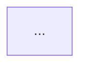

# Prompt 1 — Codex (read code, extract facts)

You are a senior embedded-systems engineer. Your task is to read the Smart Car
Access codebase and produce a structured Markdown file: `structured_facts.md`.

## YOUR ONLY JOB
Extract facts from code. Do NOT write prose. Do NOT invent anything. Output is
strictly structured Markdown: sections, bullet points, and raw Mermaid diagram
blocks.

## SOURCE OF TRUTH
The CODE is authoritative. Docs are read as context only. Whenever a doc
conflicts with code, the CODE WINS. Section 4 ("HARD FACTS") below lists exact
values the docs get wrong — apply them unconditionally.

## WHAT TO READ (authoritative — code wins over docs)

FIRMWARE (ESP32-S3, PlatformIO, Arduino + FreeRTOS):
  iot/platformio.ini
  iot/src/main.cpp
  iot/src/ccc_mailbox.cpp + include/ccc_mailbox.h
  iot/src/nfc_session.cpp + include/nfc_session.h
  iot/src/provisioning_phase.cpp + include/provisioning_phase.h
  iot/src/ble/ble.cpp, ble_auth.cpp, ble_attestation.cpp, ble_admin.cpp,
    ble_echo.cpp, pke_telemetry.cpp, utils/crypto_utils.cpp
  iot/include/ble/*.h
  iot/src/fsm/fsm.cpp, fsm_states.cpp, fsm_integration.cpp
  iot/include/fsm/*.h
  iot/src/uwb/uwb_bridge.cpp, trilateration.cpp, ekf_stub.cpp,
    access_controller.cpp, geofence.cpp, traj_inference.cpp
  iot/include/uwb/uwb_bridge.h, ranging_frame.h, uwb_geometry.h, trilateration.h,
    ekf_stub.h, access_controller.h, geofence.h, traj_inference.h, uwb_traj_model.h

TOOLS (Python):
  tools/localization_demo.py
  tools/car_position_display.py
  tools/collect_traj.py
  tools/train_traj_model.py
  tools/analyze_ekf.py
  DW3_QM33_SDK_1.1.1/SDK/Tools/uwb-qorvo-tools/scripts/fira/run_fira_twr/run_fira_bridge.py

ANDROID (Flutter + Kotlin):
  software/smart_car_app/pubspec.yaml
  software/smart_car_app/lib/main.dart
  software/smart_car_app/lib/service/*.dart
  software/smart_car_app/lib/screen/dashboard.dart, ble_uwb_screen.dart,
    master_card_flow.dart, location.dart, notifications.dart, settings.dart
  software/smart_car_app/lib/widgets/*.dart
  software/smart_car_app/android/app/src/main/java/com/example/smart_car_app/*.kt
  software/smart_car_app/android/app/src/main/java/com/smartcar/phaseb/*.kt
  software/smart_car_app/android/app/src/main/java/com/smartcaraccess/*.kt
  software/smart_car_app/packages/phaseb_handshake_bridge/**

DOCS (context only — never override code):
  README.md, docs/ARCHITECTURE.md, docs/CODEBASE_REFERENCE.md,
  docs/DATA_CONTRACTS.md, docs/API_REFERENCE.md, docs/FEATURES.md,
  docs/GLOSSARY.md, docs/KNOWN_ISSUES.md, docs/ACCESS_CONTROL.md,
  docs/AI_INTENT_RECOGNITION.md, docs/STAGE2_PLAN.md

## DO NOT READ
  - PHASE_A_AND_PHASE_B.md (outdated protocol)
  - iot/IMPLEMENTATION_SUMMARY.md, iot/PAPER.md (Stage-1)
  - iot/tools/README_VISUALIZATION.md (references removed modules)
  - UX_UI_IMPROVEMENTS.md
  - iot/src/uwb/lstm_inference.cpp, iot/include/uwb/lstm_inference.h,
    iot/include/uwb/uwb_lstm_model.h, iot/uwb_lstm_data_label*.csv
  - iot/tools/serial_csv_logger.py, realtime_lstm_visualizer.py, LSTM_SCA.ipynb,
    demo_ble_auth.py, phase_b_test.py, setup.sh
  - iot/lib/PN532/** (vendor library)
  - packages/nfc_manager/** and all generated ios/web/linux/macos/windows/ and example/ folders
  - the whole DW3_QM33_SDK_1.1.1 EXCEPT run_fira_bridge.py
  - any *.log, *.csv (except uwb_traj_data_label*.csv which is input data), *.pdf, venv/, node_modules, build artifacts

## HARD FACTS — apply these unconditionally; they override any doc
  - Anchors (uwb_geometry.h): A0=(0.00,-2.00)m rear-centre, A1=(0.95,0.00)m right, A2=(-0.95,0.00)m left B-pillar
  - Geofence zones: OUTSIDE / WELCOME r=2.5m / DRIVER_DOOR centre(-0.95,0) r=1.0m / DRIVER_SEAT centre(-0.35,0) r=0.45m
  - AccessController: 3 states LOCKED->DOOR_UNLOCKED->OCCUPIED->LOCKED; gates: deceleration (speed<0.4m/s), 3-hit unlock debounce, 3s seat-settle, radial-velocity approach, 4-class AI intent
  - Pins: RELAY_PIN=5 (door lock), IGNITION_PIN=7 (engine-start) — NOT GPIO26/27
  - EKF: 2D constant-velocity [x,y,vx,vy]; sigma_meas=clamp(RMS,0.05,1.0)m; sigma_a=1.2 m/s^2; predict per measurement; NO coasting; re-init if gap>2s or innovation>2.5m
  - Intent: TFLM Conv1D, 25x4 window [x,y,vx,vy], 4 classes approach(0)/seated(1)/leave(2)/passing(3); act if p>=0.80; hard-block unlock if p_passing>=0.70; already wired in uwb_bridge.cpp

## OUTPUT — strictly follow this 11-section structure

# structured_facts.md

## 1. Executive Summary
- [fact] one bullet per domain: Phone / Anchors+PC bridge / ESP32 ECU / Firebase cloud (cite files)

## 2. NFC Provisioning (Phase A)
- [fact] APDU sequence (from nfc_session.cpp): SELECT AID -> SPAKE2+ 0x30/0x32 -> GET DATA 0xCA -> WRITE DATA 0xD4 -> OP CONTROL 0x3C -> PROVISION RESULT 0xDA
- [fact] HCE AID string (from ProvisioningHostApduService.kt)
- [fact] NVS namespace and CCC Mailbox slots/tokens (ccc_mailbox.cpp)
- [fact] Android Keystore key alias + key type (KeystoreBridge.kt)
```mermaid
sequenceDiagram
  ...  (fill from nfc_session.cpp + provisioning_phase.cpp + ProvisioningHostApduService.kt)
```

## 3. BLE Authentication (Phase B)
- [fact] GATT service UUID + RX/TX characteristic UUIDs (ble_auth.cpp)
- [fact] INS instruction set: AUTH0 0x80 / AUTH1 0x81 / EXCHANGE 0x82 / CONTROL_FLOW 0x83 / RANGING_START 0x84 / RANGING_STOP 0x85
- [fact] ECDH + HKDF session key derivation (info string format)
- [fact] fast-transaction path (AUTH0 P1=0x01)
```mermaid
sequenceDiagram
  ...
```

## 4. UWB Localization Pipeline
- [fact] ranging topology: phone 0x06C1 -> anchors -> PC bridge -> "RANGE:d0,d1,d2,valid" over USB-CDC
- [fact] trilateration: 2-circle closed form (n=2) / Gauss-Newton (n=3), returns (x,y,rms)
- [fact] EKF state model, process/measurement noise, no-coasting rule
- [hard] anchor coordinates (from HARD FACTS)


## 5. Access Control & Geofencing
- [hard] 4 zones with exact centres/radii (geofence.h)
- [fact] 3-state machine + every gate (access_controller.cpp)
- [hard] RELAY_PIN=5, IGNITION_PIN=7


## 6. Intent Recognition (TinyML)
- [fact] pipeline: localization_demo.py --capture -> collect_traj.py -> train_traj_model.py -> uwb_traj_model.h -> traj_inference.cpp (TFLM)
- [hard] window 25x4, 4 classes, thresholds 0.80 / 0.70
- [fact] scaler mean/scale values (traj_inference.h)


## 7. Mobile App Architecture
- [fact] Flutter service layer: list each lib/service/*.dart and its role
- [fact] Kotlin native modules (HCE, Keystore, PhaseBCrypto, UwbMulticastBridge, DataStoreUtil)
- [fact] background service / dual-isolate handoff (pke_background_service.dart)
- [fact] pubspec.yaml dependencies relevant to NFC/BLE/UWB

## 8. Cloud & Anomaly Detection
- [fact] Firebase collections/schema (from DATA_CONTRACTS.md + car_service.dart)
- [fact] anomaly pipeline: anomaly_scorer -> time/location/frequency detectors -> decision engine (ALLOW/CONFIRM/BLOCK)
- [fact] Gemini 2.5 Flash Lite enrichment (ai_service.dart)
- [fact] GPS encrypted packet format + HMAC (gps_service.dart)

## 9. FreeRTOS Runtime & Data Contracts
- [fact] tasks from main.cpp: name, priority, stack size, role
- [fact] RangingFrame fields (ranging_frame.h): t_ms, d[3], valid_mask
- [fact] EKF state fields: [px, py, vx, vy], covariance P[4][4]
- [fact] Geofence::Zone enum values

## 10. Key Constants Table
| Constant | Value | Source file |
|----------|-------|-------------|
| kAnchorX/Y (A0/A1/A2) | (0,-2)/(0.95,0)/(-0.95,0) m | uwb_geometry.h |
| kDoorX/kDoorY/kDoorRadiusM | -0.95 / 0.0 / 1.0 | geofence.h |
| kSeatX/kSeatY/kSeatRadiusM | -0.35 / 0.0 / 0.45 | geofence.h |
| kWelcomeRadiusM | 2.5 | geofence.h |
| RELAY_PIN / IGNITION_PIN | 5 / 7 | access_controller.h |
| STILL_SPEED_MPS | 0.4 | access_controller.h |
| REQUIRED_CONSECUTIVE_HITS | 3 | access_controller.h |
| SEAT_SETTLE_MS | 3000 | access_controller.h |
| LEAVE_CONSECUTIVE_HITS | 3 | access_controller.h |
| APPROACH_SPEED_MIN_MPS | 0.10 | access_controller.h |
| RELAY_PULSE_MS | 500 | access_controller.h |
| INTENT_APPROACH/SEATED/LEAVE_THRESHOLD | 0.80 | access_controller.h |
| INTENT_PASSING_BLOCK | 0.70 | access_controller.h |
| kAccelStd (EKF) | 1.2 m/s^2 | ekf_stub.cpp |
| EKF meas-noise clamp | 0.05–1.0 m | ekf_stub.cpp |
| kMaxGapS / kMaxInnovationM / kMaxSpeedMps | 2.0 s / 2.5 m / 2.0 m/s | ekf_stub.cpp |
| kDrivePeriodMs / kMaxCoastMs | 100 / 500 ms | uwb_bridge.cpp |
| TIME_STEPS / NUM_FEATURES / NUM_CLASSES | 25 / 4 / 4 | traj_inference.h |
| (add any other numeric constant you find; do NOT invent) | | |

## 11. End-to-End Unlock Sequence
```mermaid
sequenceDiagram
  ... (connect Phase A -> Phase B -> ranging -> trilateration -> EKF -> geofence -> intent gate -> relay)
```

## RULES
- Every [fact] cites its source file in parentheses: (ekf_stub.cpp)
- [hard] tag = value taken from HARD FACTS; keep it verbatim
- If a doc conflicts with code, use the code value and append: [doc says X — overridden]
- If you cannot find a value in code, write: [NOT FOUND IN CODE]
- Zero invented values. Zero prose paragraphs.
