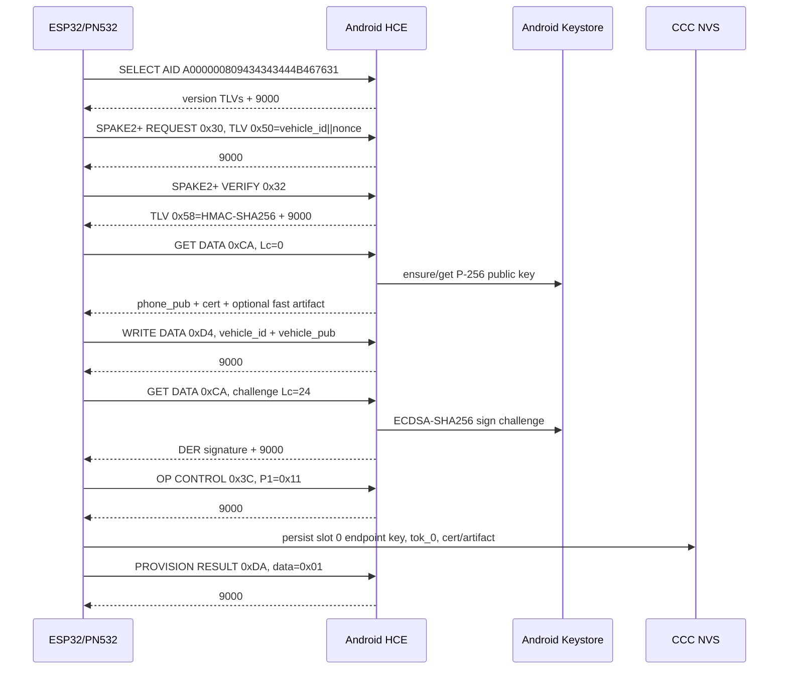
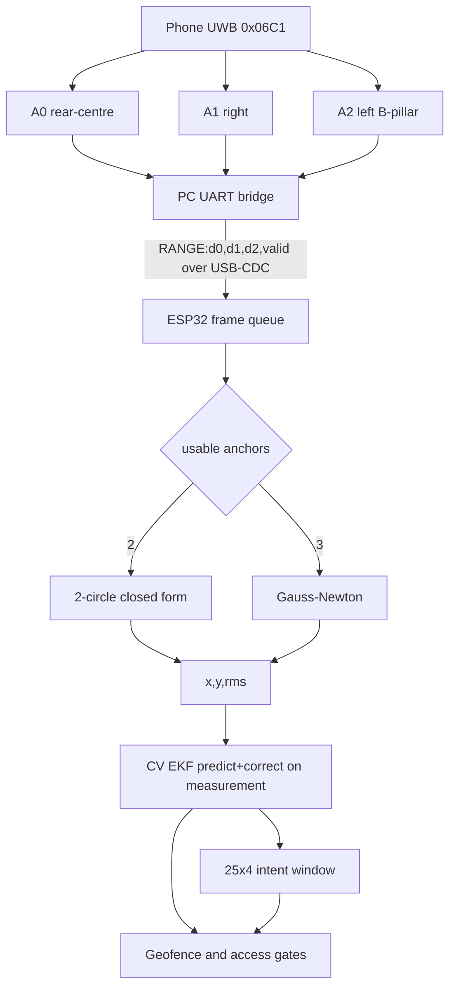
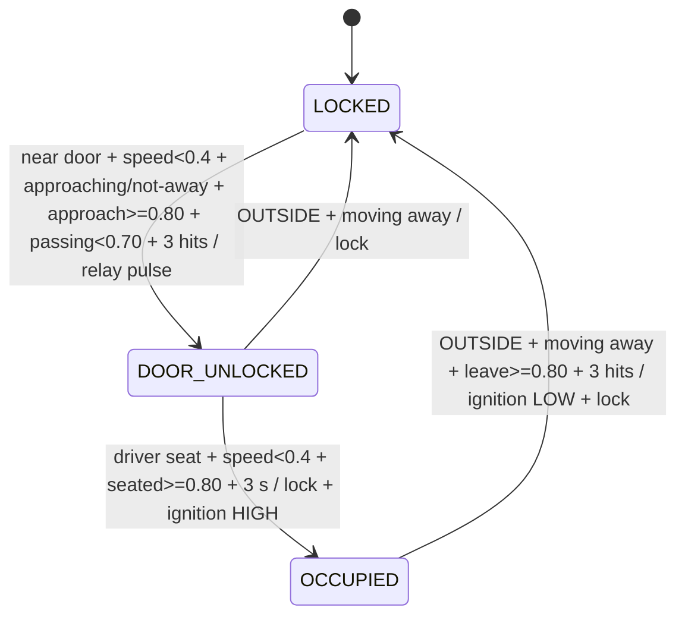
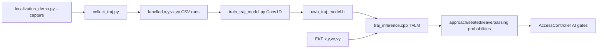
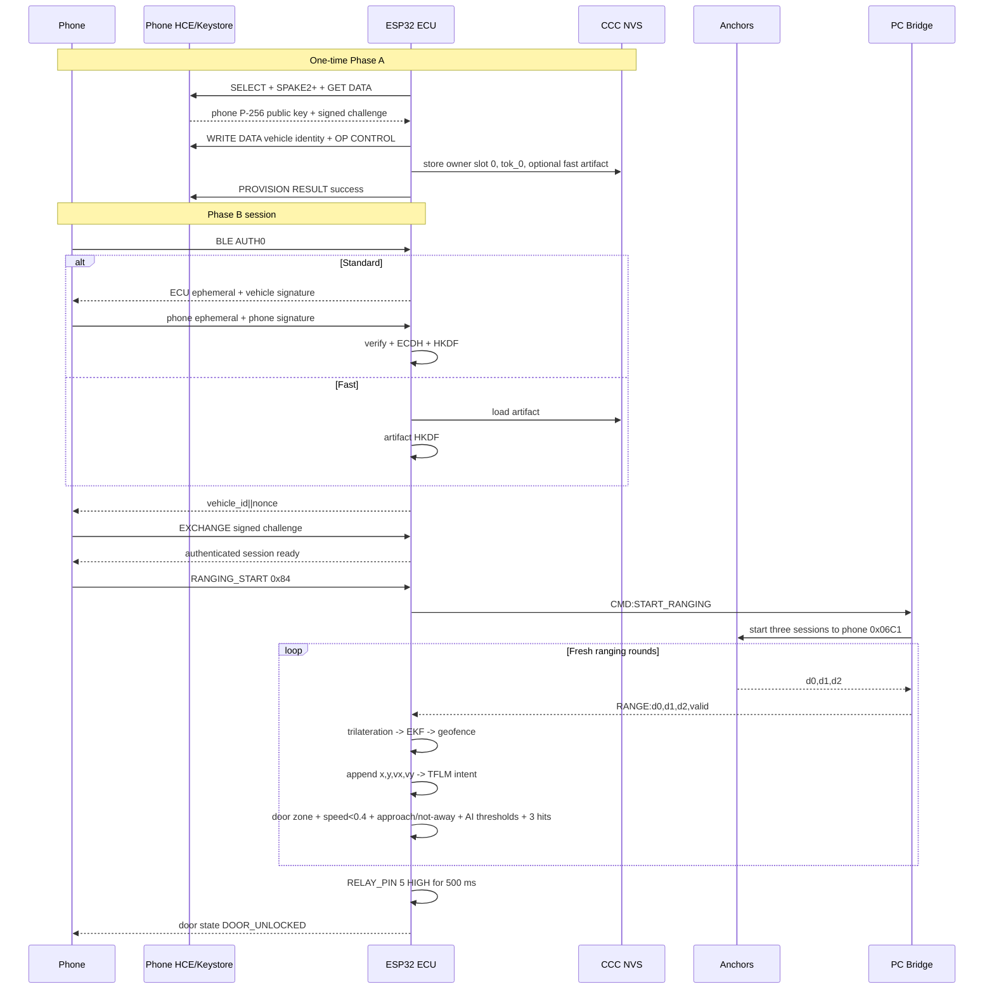

# structured_facts.md

## 1. Executive Summary

- [fact] Phone: Flutter orchestrates NFC master-card intake, native Android HCE provisioning, BLE Phase-B authentication, background scanning/authentication, and Android multicast UWB ranging. (`main.dart`, `master_card_provisioning.dart`, `ProvisioningHostApduService.kt`, `pke_auth_orchestrator.dart`, `pke_background_service.dart`, `UwbMulticastBridge.kt`)
- [fact] Anchors+PC bridge: phone/controller address `0x06C1` ranges with three anchor sessions; the PC bridge reads the anchor UARTs and forwards `RANGE:d0=...,d1=...,d2=...,valid=...` to the ESP32-S3 over USB-CDC. (`run_fira_bridge.py`)
- [fact] ESP32 ECU: Arduino/FreeRTOS firmware runs NFC, BLE/FSM, UWB parsing, trilateration, 2D constant-velocity EKF, TinyML intent inference, geofencing, and relay/ignition access control. (`platformio.ini`, `main.cpp`, `uwb_bridge.cpp`, `access_controller.cpp`)
- [fact] Firebase cloud: Firebase Authentication identifies the user; Firestore stores cars, digital keys, owner-provisioning metadata, access/anomaly history, and anomaly decisions; immobilizer tokens and private keys are not cloud fields. (`auth.dart`, `car_service.dart`, `anomaly_detection_service.dart`, `DATA_CONTRACTS.md`)

## 2. NFC Provisioning (Phase A)

- [fact] APDU order: SELECT AID `00 A4 04 00` -> SPAKE2+ REQUEST `INS=0x30` -> SPAKE2+ VERIFY `INS=0x32` -> base GET DATA `INS=0xCA,Lc=0` -> WRITE DATA `INS=0xD4` -> signature GET DATA `INS=0xCA,Lc=24` -> OP CONTROL `INS=0x3C,P1=0x11` -> PROVISION RESULT `INS=0xDA,data=0x01`. (`nfc_session.cpp`)
- [fact] SPAKE2+ challenge is `vehicle_id[8] || random_nonce[16]`; REQUEST carries it in TLV `0x50`, and VERIFY returns TLV `0x58` containing a 32-byte HMAC-SHA256 checked against the master secret. (`nfc_session.cpp`)
- [fact] Base GET DATA parses `[keyIdLen][keyId][phone_pub_65][certLen_be16][cert]`, plus optional fast-artifact TLVs `0x90` version and `0x91` 32-byte key. (`nfc_session.cpp`)
- [fact] WRITE DATA carries TLV `0x80,len=8,vehicle_id` and TLV `0x81,len=65,vehicle_pub`; the signature GET DATA response carries `[sigLen_be16][ECDSA-P256 DER signature]`. (`nfc_session.cpp`)
- [fact] HCE AID: `A000000809434343444B467631`. (`ProvisioningHostApduService.kt`)
- [fact] NVS namespace: `ccc_dk`; identity/bookkeeping keys are `v_id`, `v_pub`, `v_priv`, `sig_bmp`, and `slot_bmp`; eight slots use `ep_0`..`ep_7` for 65-byte endpoint public keys and `tok_0`..`tok_7` for 32-byte immobilizer tokens; slot 0 is owner and slots 1-7 are friends. (`ccc_mailbox.cpp`, `ccc_mailbox.h`)
- [fact] Provisioning-only NVS keys in the same `ccc_dk` namespace are `cert_chain`, `fast_art_ver`, `fast_art_key`, `force_prov`, and `oneshot_force`. (`provisioning_phase.cpp`)
- [fact] Successful owner provisioning stores the phone public key in slot 0, activates slot 0, generates `tok_0`, and clears signaling bit `0x0001`; existing provisioning is rejected unless force mode is active. (`provisioning_phase.cpp`)
- [fact] Android Keystore alias: `smart_car_phone_identity_p256`; provider: `AndroidKeyStore`; key: EC `secp256r1`, SHA-256 digest, sign/verify purposes, no user-authentication requirement. (`KeystoreBridge.kt`)



## 3. BLE Authentication (Phase B)

- [fact] GATT authentication service UUID: `0000aaaa-1234-5678-9abc-def012345678`; CCC RX write characteristic: `0000aac1-1234-5678-9abc-def012345678`; CCC TX read/notify characteristic: `0000aac2-1234-5678-9abc-def012345678`. (`ble_auth.cpp`)
- [fact] Tunnel instructions: AUTH0 `0x80`, AUTH1 `0x81`, EXCHANGE `0x82`, CONTROL_FLOW `0x83`, RANGING_START `0x84`, RANGING_STOP `0x85`. (`ble_auth.cpp`)
- [fact] Standard AUTH0 uses `P1=0x11`; the ECU generates a P-256 ephemeral pair, returns its 65-byte public key, and sends AUTH1 `[ecu_ephemeral_pub_65][vehicle_sig_len_le16][vehicle_ECDSA_DER]`. (`ble_auth.cpp`)
- [fact] Phone AUTH1 carries `[phone_ephemeral_pub_65][phone_sig_len_le16][phone_ECDSA_DER]`; the ECU verifies the phone ephemeral key signature with the provisioned endpoint public key. (`ble_auth.cpp`)
- [fact] Standard session keys derive from a 32-byte P-256 ECDH secret using HKDF-SHA256 with empty salt; ENC info is `16-byte("SmartCarv1|ENC" + zero padding) || ecu_ephemeral_pub_65 || phone_ephemeral_pub_65`, and MAC info substitutes `SmartCarv1|MAC`; each output is 32 bytes. (`ble_auth.cpp`)
- [fact] After key derivation, the ECU publishes `vehicle_id[8] || nonce[16]`; the phone signs that 24-byte challenge, EXCHANGE returns it, and the ECU verifies it with the stored phone public key before marking the session ready. (`ble_auth.cpp`)
- [fact] Fast transaction uses AUTH0 `P1=0x01` with requested artifact version in the data; when rollout permits it and the stored version matches, the ECU derives keys from the 32-byte artifact, returns the 24-byte challenge directly, and skips AUTH1/ECDH. (`ble_auth.cpp`, `platformio.ini`)
- [fact] Fast ENC/MAC HKDF info is `16-byte("SmartCarFast|ENC" or "SmartCarFast|MAC", zero-padded) || vehicle_id[8] || artifact_version[1]`; salt is empty and each key is 32 bytes. (`ble_auth.cpp`)
- [fact] RANGING_START/STOP require ready session keys and call `UwbBridge::sendStart()`/`sendStop()`; CONTROL_FLOW also requires ready session keys and raises the FSM unlock-request event. (`ble_auth.cpp`)

```mermaid
sequenceDiagram
  participant Phone
  participant ECU
  participant NVS
  Phone->>ECU: Connect GATT
  alt Standard path P1=0x11
    Phone->>ECU: AUTH0 0x80
    ECU-->>Phone: ECU ephemeral P-256 public key
    ECU-->>Phone: AUTH1 0x81, ECU ephemeral + vehicle signature
    Phone->>ECU: AUTH1 0x81, phone ephemeral + phone signature
    ECU->>NVS: load provisioned phone public key
    ECU->>ECU: verify signature, ECDH, HKDF ENC/MAC
  else Fast path P1=0x01
    Phone->>ECU: AUTH0 0x80, artifact version
    ECU->>NVS: load matching 32-byte fast artifact
    ECU->>ECU: HKDF fast ENC/MAC; skip AUTH1/ECDH
  end
  ECU-->>Phone: 24-byte vehicle_id||nonce challenge
  Phone->>ECU: EXCHANGE 0x82, signed challenge
  ECU->>ECU: verify with provisioned phone key
  ECU-->>Phone: EXCHANGE 9000; session ready
  Phone->>ECU: CONTROL_FLOW 0x83
  ECU-->>Phone: CONTROL_FLOW 9000
  Phone->>ECU: RANGING_START 0x84
  ECU-->>Phone: 9000
```

## 4. UWB Localization Pipeline

- [fact] Topology: phone/controller UWB address `0x06C1` -> three anchors -> per-anchor PC UART clients -> PC bridge -> ESP32 USB-CDC line `RANGE:d0=<m>,d1=<m>,d2=<m>,valid=<0|1>`. (`run_fira_bridge.py`)
- [fact] Default anchor UART order is exemplified as COM11/COM19/COM12 and maps to d0 rear-centre/d1 right/d2 left B-pillar; the bridge starts/stops every anchor on `CMD:START_RANGING`/`CMD:STOP_RANGING` and acknowledges with `ACK:` lines. (`run_fira_bridge.py`, `uwb_geometry.h`)
- [fact] ESP32 ignores the aggregate `valid` value when constructing `valid_mask`; each positive distance sets its own mask bit, permitting a 2-anchor solve. (`uwb_bridge.cpp`)
- [fact] Trilateration uses a two-circle closed-form solution for exactly two usable anchors and a maximum-10-iteration Gauss-Newton least-squares refinement for three; the result is `(x,y,rms,valid)`. (`trilateration.cpp`, `trilateration.h`)
- [hard] Anchors (uwb_geometry.h): A0=(0.00,-2.00)m rear-centre, A1=(0.95,0.00)m right, A2=(-0.95,0.00)m left B-pillar
- [hard] EKF: 2D constant-velocity [x,y,vx,vy]; sigma_meas=clamp(RMS,0.05,1.0)m; sigma_a=1.2 m/s^2; predict per measurement; NO coasting; re-init if gap>2s or innovation>2.5m
- [fact] EKF default measurement standard deviation is 0.15 m when the supplied value is non-positive; initial velocity variance is 4.0 `(m/s)^2`, velocity is clamped to 2.0 m/s, and every accepted fix performs predict then correct. (`ekf_stub.cpp`)
- [fact] `kDrivePeriodMs=100` controls how often the last corrected estimate drives inference/access; `kMaxCoastMs=500` suppresses access updates after stale fixes and does not perform prediction between measurements. (`uwb_bridge.cpp`)



## 5. Access Control & Geofencing

- [hard] Geofence zones: OUTSIDE / WELCOME r=2.5m / DRIVER_DOOR centre(-0.95,0) r=1.0m / DRIVER_SEAT centre(-0.35,0) r=0.45m
- [fact] Classification priority is DRIVER_SEAT -> DRIVER_DOOR -> WELCOME -> OUTSIDE; stateful zone output changes only after three consecutive samples of a candidate zone. (`geofence.cpp`, `geofence.h`, `access_controller.cpp`)
- [hard] AccessController: 3 states LOCKED->DOOR_UNLOCKED->OCCUPIED->LOCKED; gates: deceleration (speed<0.4m/s), 3-hit unlock debounce, 3s seat-settle, radial-velocity approach, 4-class AI intent
- [fact] LOCKED unlock gates: zone is not OUTSIDE; radial velocity is not moving away above `0.10 m/s`; passing probability is below `0.70`; zone is DRIVER_DOOR or DRIVER_SEAT; speed is below `0.4 m/s`; approach probability is at least `0.80`; all conditions persist for three hits. (`access_controller.cpp`)
- [fact] DOOR_UNLOCKED -> OCCUPIED gates: DRIVER_SEAT, speed below `0.4 m/s`, seated probability at least `0.80`, and continuous 3000 ms seat settle; transition locks the relay output and authorizes ignition. (`access_controller.cpp`)
- [fact] DOOR_UNLOCKED -> LOCKED occurs when the stable zone is OUTSIDE and radial velocity is moving away above `0.10 m/s`; no leave-hit debounce or leave-intent threshold is applied on this path. (`access_controller.cpp`)
- [fact] OCCUPIED -> LOCKED gates: OUTSIDE, radial velocity moving away above `0.10 m/s`, leave probability at least `0.80`, and three consecutive hits; transition revokes ignition and locks. (`access_controller.cpp`)
- [fact] When inference is unavailable or the 25-frame window is warming up, AI gates are skipped with approach/seated/leave treated as `1.0` and passing as `0.0`. (`access_controller.cpp`, `uwb_bridge.cpp`)
- [hard] RELAY_PIN=5, IGNITION_PIN=7
- [fact] Unlock drives RELAY_PIN HIGH for 500 ms; LOW is locked; ignition authorization drives IGNITION_PIN HIGH. (`access_controller.cpp`, `access_controller.h`)



## 6. Intent Recognition (TinyML)

- [fact] Data/model pipeline: `localization_demo.py --capture` tees raw ESP32 lines -> `collect_traj.py` extracts labelled `[EKF]` rows -> `train_traj_model.py` trains and converts a TFLite model -> `uwb_traj_model.h` embeds model bytes -> `traj_inference.cpp` runs TensorFlow Lite Micro. (`localization_demo.py`, `collect_traj.py`, `train_traj_model.py`, `traj_inference.cpp`)
- [fact] Training rows are `run_id,timestamp_ms,x,y,vx,vy,label`; train/test splitting is by run, StandardScaler is fitted on training features, and sliding windows do not cross run boundaries. (`collect_traj.py`, `train_traj_model.py`)
- [fact] Model architecture: Conv1D(16,kernel=3,ReLU) -> MaxPool(2) -> Conv1D(32,kernel=3,ReLU) -> MaxPool(2) -> Flatten -> Dense(16,ReLU) -> Dropout(0.2) -> Dense(4,softmax). (`train_traj_model.py`)
- [hard] Intent: TFLM Conv1D, 25x4 window [x,y,vx,vy], 4 classes approach(0)/seated(1)/leave(2)/passing(3); act if p>=0.80; hard-block unlock if p_passing>=0.70; already wired in uwb_bridge.cpp
- [fact] Scaler mean `[x,y,vx,vy] = [-1.176990,-0.693135,-0.019802,0.006809]`; scaler scale `[1.118417,1.425282,0.187332,0.270498]`. (`traj_inference.h`)
- [fact] TFLM uses a 44 KiB tensor arena, requires float32 input/output tensors, and returns no prediction until 25 frames fill the window. (`traj_inference.cpp`)



## 7. Mobile App Architecture

- [fact] `ai_service.dart`: computes time/location/frequency risk features, calls Gemini 2.5 Flash Lite, parses JSON, and provides a rule-based fallback. (`ai_service.dart`)
- [fact] `anomaly_decision_engine.dart`: maps confidence to LOW/MEDIUM/HIGH and ALLOW/CONFIRM/BLOCK, plus messages and notification payloads. (`anomaly_decision_engine.dart`)
- [fact] `anomaly_detection_service.dart`: coordinates deterministic time/location analysis, constructs AI features, calls `AnomalyScorer`, and logs analyses/decisions to Firestore. (`anomaly_detection_service.dart`)
- [fact] `anomaly_scorer.dart`: defines anomaly input/output DTOs and delegates scoring to `AIService.detectAnomalyWithAI`. (`anomaly_scorer.dart`)
- [fact] `auth.dart`: wraps Firebase Authentication current-user, registration, sign-in, sign-out, and UI error reporting. (`auth.dart`)
- [fact] `background_service_control.dart`: persists the background-service enabled flag and starts, stops, or toggles `flutter_background_service`. (`background_service_control.dart`)
- [fact] `ble_phase_test.dart`: exposes Phase A status and delegates Phase B tests, ranging, and GPS packet sends to `PkeAuthOrchestrator`. (`ble_phase_test.dart`)
- [fact] `ble_runtime_permissions.dart`: checks Android SDK level and requests runtime BLE permissions; it can open app settings. (`ble_runtime_permissions.dart`)
- [fact] `car_service.dart`: CRUD for cars/digital keys, owner-provisioning registry writes, and simulated car-control field updates in Firestore. (`car_service.dart`)
- [fact] `database.dart`: writes user information to `User/{userId}`. (`database.dart`)
- [fact] `doze_exemption_service.dart`: queries/requests Android battery-optimization exemption and opens optimization settings. (`doze_exemption_service.dart`)
- [fact] `gps_service.dart`: obtains GPS, reverse-geocodes it, serializes a 32-byte little-endian payload, XOR-encrypts it, and appends HMAC-SHA256. (`gps_service.dart`)
- [fact] `initial_data_helper.dart`: seeds initial Firestore car/key data and presents success/error UI feedback. (`initial_data_helper.dart`)
- [fact] `language_service.dart`: provides localized strings, tracks the selected language, and persists it in SharedPreferences. (`language_service.dart`)
- [fact] `location_anomaly_detector.dart`: evaluates distance from familiar locations, location diversity, movement speed, and familiar-region frequency using `access_logs`. (`location_anomaly_detector.dart`)
- [fact] `master_card_provisioning.dart`: reads/parses the NFC master-card NDEF JSON, persists pending payloads, controls the native HCE master-card session, and reads native provisioning bindings. (`master_card_provisioning.dart`)
- [fact] `nfc_provisioning_service.dart`: disabled compatibility stub; native `ProvisioningHostApduService` owns the active HCE provisioning protocol. (`nfc_provisioning_service.dart`)
- [fact] `notification_service.dart`: builds severity-specific in-app notifications and confirmation/blocking dialogs. (`notification_service.dart`)
- [fact] `pke_auth_orchestrator.dart`: scans/connects with FlutterBluePlus, executes standard or fast Phase B over the CCC tunnel, retains session keys, sends GPS, and requests ranging start/stop. (`pke_auth_orchestrator.dart`)
- [fact] `pke_background_service.dart`: runs foreground-mode Android background scanning/authentication, telemetry/backoff, and a dual-isolate UWB handoff. (`pke_background_service.dart`)
- [fact] `pke_rollout_flags.dart`: persists rollout flags for background mode, fast transaction, bonding enforcement, and RSSI policy. (`pke_rollout_flags.dart`)
- [fact] `pke_telemetry.dart`: defines PKE telemetry event/schema objects and structured debug emission. (`pke_telemetry.dart`)
- [fact] `push_notification_service.dart`: configures local Android/iOS notification channels, displays system notifications, handles taps, and cancels notifications. (`push_notification_service.dart`)
- [fact] `time_anomaly_detector.dart`: scores unusual hours, rare weekend use, and more than five accesses in one hour using `access_logs`. (`time_anomaly_detector.dart`)
- [fact] `uwb_multi_service.dart`: Dart MethodChannel/EventChannel wrapper for native multicast UWB support, permissions, session start/stop, statuses, and three-distance rounds. (`uwb_multi_service.dart`)
- [fact] Kotlin HCE module: `ProvisioningHostApduService` handles SELECT/SPAKE2+/GET DATA/WRITE DATA/OP CONTROL/PROVISION RESULT; `DataStoreUtil` persists UID, vehicle binding, and fast artifact; `KeystoreBridge` owns the Phase-A P-256 identity. (`ProvisioningHostApduService.kt`, `DataStoreUtil.kt`, `KeystoreBridge.kt`)
- [fact] Kotlin Phase-B module: `HandshakeChannel` exposes native crypto to Flutter; `PhaseBCrypto` generates P-256 ephemeral keys, signs, computes ECDH, derives session keys, and signs the ECU challenge. (`HandshakeChannel.kt`, `PhaseBCrypto.kt`)
- [fact] Kotlin UWB module: `UwbMulticastBridge` uses Android `android.ranging` multicast DS-TWR, exposes `smartcar/uwb_multi` plus an event channel, requires API 36, and emits aggregate range/status events. (`UwbMulticastBridge.kt`)
- [fact] Dual-isolate handoff: the background isolate authenticates and holds BLE, invokes `runUwbHandoff`; the foreground isolate reconnects by known MAC, sends ECU RANGING_START, starts native multicast UWB, returns `uwbHandoffResult`, then the background orchestrator releases its connection; stop uses the reverse `stopUwbHandoff`/`uwbHandoffStopped` exchange. (`pke_background_service.dart`)
- [fact] NFC/BLE/UWB-relevant dependencies: `nfc_manager` 4.1.1 with local override; `flutter_blue_plus` 1.18.5; `pointycastle` 3.9.0; `asn1lib` 1.5.0; `crypto` 3.0.3; `cryptography` 2.7.0; `flutter_secure_storage` 9.2.2; `shared_preferences` 2.3.2; `permission_handler` 11.3.1; `wakelock_plus` 1.2.5; `geolocator` 13.0.2; `flutter_background_service` 5.1.0; `flutter_background_service_android` 6.3.0; local `phaseb_handshake_bridge`. (`pubspec.yaml`)

## 8. Cloud & Anomaly Detection

- [fact] Firestore `cars/{carId}` stores owner-controlled car state and an `ownerProvisioning` object containing `vehicle_id`, `owner_uid`, `device_pub_key`, `vehicle_pub_key`, status, slot-0 owner metadata, and optional write-data/scanned-vehicle fields; canonical `Vehicles/{vehicleIdHex}` mirrors the owner record best-effort. (`car_service.dart`)
- [fact] Firestore `digital_keys/{keyId}` stores owner ID, car ID, name/type/status, permissions, validity, and timestamps. (`car_service.dart`)
- [fact] Firestore `access_logs/{id}` supplies user/car/timestamp/location history to time, frequency, and location detectors; `anomaly_analysis/{id}` stores deterministic analysis details; `anomaly_decisions/{id}` stores AI-enriched decisions. (`time_anomaly_detector.dart`, `location_anomaly_detector.dart`, `anomaly_detection_service.dart`)
- [fact] User records are written to `User/{userId}`. (`database.dart`) [doc says `users/{uid}` — overridden]
- [fact] Deterministic anomaly path: `AnomalyDetectionService` -> `TimeAnomalyDetector` plus `LocationAnomalyDetector`; frequency is evaluated inside the time detector from one-hour access history; the two confidence values are summed and logged. (`anomaly_detection_service.dart`, `time_anomaly_detector.dart`, `location_anomaly_detector.dart`)
- [fact] AI anomaly path: time/location/frequency features -> `AnomalyScorer` -> Gemini-backed `AIService`; risk weights are 30% time, 30% location, and 40% frequency, with rule-based fallback on API failure. (`anomaly_detection_service.dart`, `anomaly_scorer.dart`, `ai_service.dart`)
- [fact] Standalone `AnomalyDecisionEngine` maps confidence `<=0.60` to LOW/ALLOW, `<=0.85` to MEDIUM/CONFIRM, and `>0.85` to HIGH/BLOCK; no other source file invokes `processDecision`. (`anomaly_decision_engine.dart`)
- [fact] `AIService` calls `gemini-2.5-flash-lite:generateContent`, requests a JSON anomaly decision, parses the first candidate text, and falls back to local rules when HTTP/parsing fails. (`ai_service.dart`)
- [fact] GPS plaintext is 32 bytes little-endian: latitude float64, longitude float64, altitude float32, accuracy float32, timestamp int64 milliseconds; it is XORed byte-for-byte with the 32-byte session ENC key, then concatenated with HMAC-SHA256(ciphertext, 32-byte session MAC key) for a 64-byte packet. (`gps_service.dart`, `ble_auth.cpp`) [doc says lon/lat/alt le32 ×3 + accuracy u16 + timestamp u32 — overridden]

## 9. FreeRTOS Runtime & Data Contracts

- [fact] Task `FSM`: pinned to core 1, priority 6, stack 8192 bytes; runs `FSM::tick()` every 1 ms. (`main.cpp`)
- [fact] Task `NFC`: pinned to core 1, priority 4, stack 8192 bytes; runs `NfcSession::tick()` every 2 ms. (`main.cpp`)
- [fact] Task `UWB`: pinned to core 1, priority 5, stack 20480 bytes; reads USB-CDC RANGE/ACK lines, runs `UwbBridge::tick()` and `AccessController::tick()`, then delays 5 ms. (`main.cpp`)
- [fact] Arduino `loop()` runs `BLEMod::tick()` and delays 50 ms. (`main.cpp`)
- [fact] `RangingFrame` fields: `uint32_t t_ms`, `double d[3]`, `uint8_t valid_mask`; mask bit i means d[i] is fresh/in-bounds after parsing. (`ranging_frame.h`, `uwb_bridge.cpp`)
- [fact] EKF state fields: private `g_x[4]=[px,py,vx,vy]` and covariance `g_P[4][4]`; timestamps are `g_lastMs` and `g_lastMeasMs`. (`ekf_stub.cpp`)
- [fact] `Geofence::Zone` implicit values: `OUTSIDE=0`, `WELCOME=1`, `DRIVER_DOOR=2`, `DRIVER_SEAT=3`. (`geofence.h`)
- [fact] CCC tunnel request frame is `[CLA,INS,P1,P2,Lc,data...]`; responses are emitted over the TX notify characteristic with the originating instruction and status/data. (`ble_auth.cpp`)
- [fact] PC serial contracts: PC -> ECU `RANGE:d0=...,d1=...,d2=...,valid=...` and `ACK:...`; ECU -> PC `CMD:START_RANGING` and `CMD:STOP_RANGING`. (`uwb_bridge.cpp`, `run_fira_bridge.py`)

## 10. Key Constants Table

| Constant | Value | Source file |
|----------|-------|-------------|
| `kAnchorX/Y` (A0/A1/A2) | `(0,-2)/(0.95,0)/(-0.95,0)` m | `uwb_geometry.h` |
| `kDoorX/kDoorY/kDoorRadiusM` | `-0.95 / 0.0 / 1.0` | `geofence.h` |
| `kSeatX/kSeatY/kSeatRadiusM` | `-0.35 / 0.0 / 0.45` | `geofence.h` |
| `kWelcomeRadiusM` | `2.5` | `geofence.h` |
| `RELAY_PIN / IGNITION_PIN` | `5 / 7` | `access_controller.h` |
| `STILL_SPEED_MPS` | `0.4` | `access_controller.h` |
| `REQUIRED_CONSECUTIVE_HITS` | `3` | `access_controller.h` |
| `SEAT_SETTLE_MS` | `3000` | `access_controller.h` |
| `LEAVE_CONSECUTIVE_HITS` | `3` | `access_controller.h` |
| `APPROACH_SPEED_MIN_MPS` | `0.10` | `access_controller.h` |
| `RELAY_PULSE_MS` | `500` | `access_controller.h` |
| `INTENT_APPROACH/SEATED/LEAVE_THRESHOLD` | `0.80` | `access_controller.h` |
| `INTENT_PASSING_BLOCK` | `0.70` | `access_controller.h` |
| `kAccelStd` (EKF) | `1.2 m/s^2` | `ekf_stub.cpp` |
| EKF meas-noise clamp | `0.05–1.0 m` | `ekf_stub.cpp` |
| `kDefaultMeasStd / kInitVelVar / kNominalDtS` | `0.15 m / 4.0 (m/s)^2 / 0.10 s` | `ekf_stub.cpp` |
| `kMaxGapS / kMaxInnovationM / kMaxSpeedMps` | `2.0 s / 2.5 m / 2.0 m/s` | `ekf_stub.cpp` |
| `kDrivePeriodMs / kMaxCoastMs` | `100 / 500 ms` | `uwb_bridge.cpp` |
| UWB frame queue depth | `8` | `uwb_bridge.cpp` |
| `TIME_STEPS / NUM_FEATURES / NUM_CLASSES` | `25 / 4 / 4` | `traj_inference.h` |
| TFLM tensor arena | `44 * 1024 bytes` | `traj_inference.cpp` |
| Scaler mean | `[-1.176990,-0.693135,-0.019802,0.006809]` | `traj_inference.h` |
| Scaler scale | `[1.118417,1.425282,0.187332,0.270498]` | `traj_inference.h` |
| AUTH service / RX / TX UUID | `0000aaaa...5678 / 0000aac1...5678 / 0000aac2...5678` | `ble_auth.cpp` |
| AUTH0 standard / fast P1 | `0x11 / 0x01` | `ble_auth.cpp` |
| AUTH0/AUTH1/EXCHANGE/CONTROL/RANGING_START/RANGING_STOP | `0x80/0x81/0x82/0x83/0x84/0x85` | `ble_auth.cpp` |
| HCE AID | `A000000809434343444B467631` | `ProvisioningHostApduService.kt` |
| `SPAKE2_CHALLENGE_TTL_MS` | `45000 ms` | `ProvisioningHostApduService.kt` |
| CCC maximum slots | `8` | `ccc_mailbox.cpp` |
| Phase-A challenge | `8-byte vehicle ID + 16-byte nonce = 24 bytes` | `nfc_session.cpp` |
| PC bridge destination/session/channel/preamble | `0x06C1 / 42 / 9 / 9` | `run_fira_bridge.py` |
| PC bridge rate/freshness/distance bounds | `10 Hz / 500 ms / 0.1–30.0 m` | `run_fira_bridge.py` |
| FSM event queue | `16` | `fsm.cpp` |
| NFC UART RX/TX/baud | `44 / 43 / 115200` | `main.cpp` |

## 11. End-to-End Unlock Sequence


