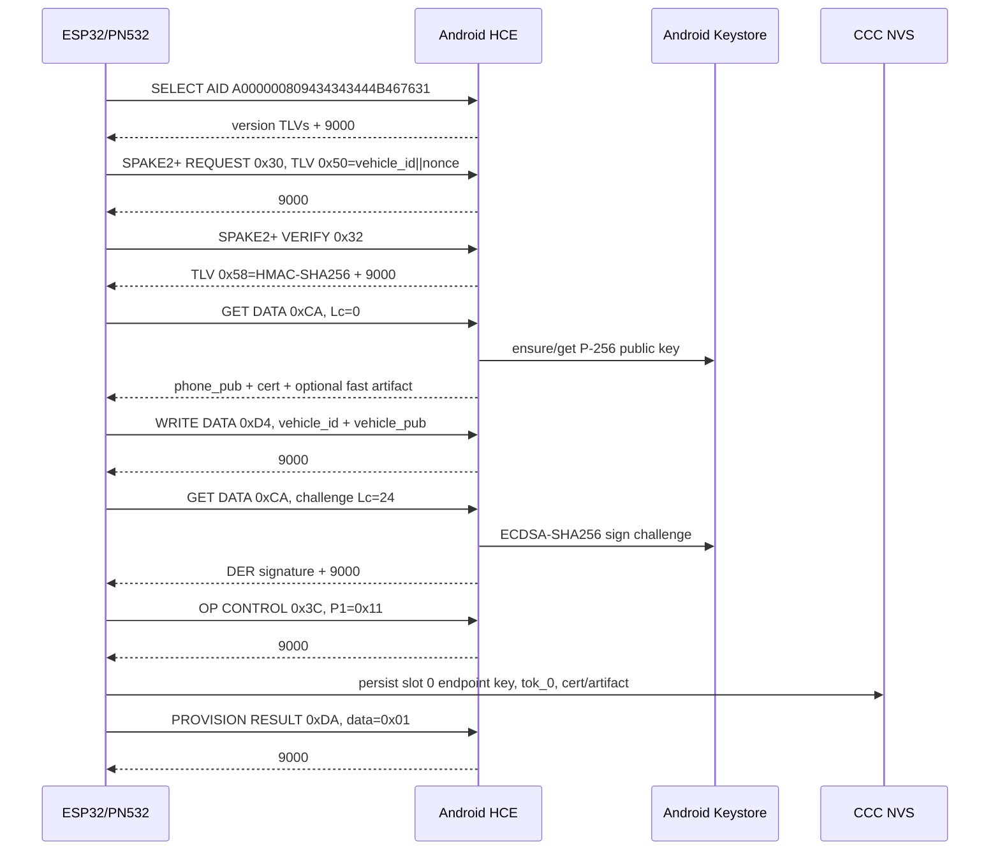
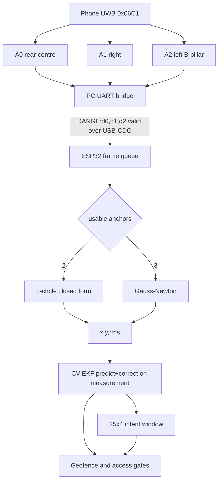
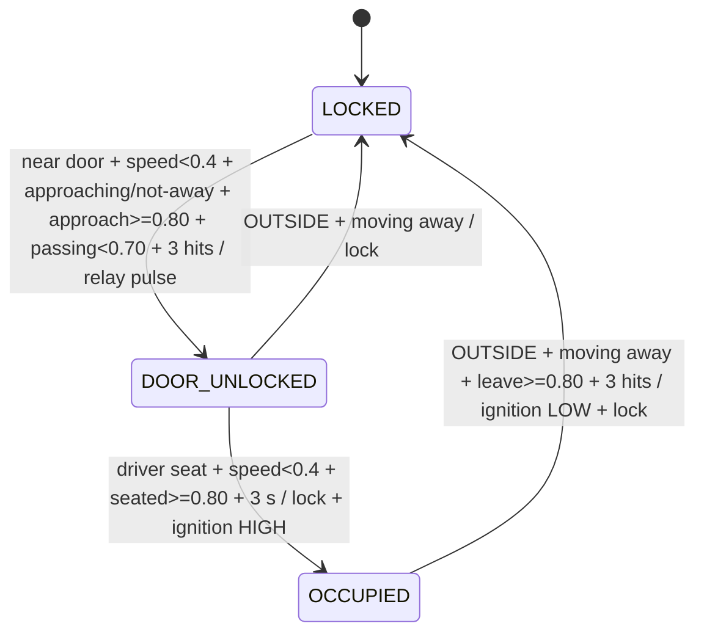
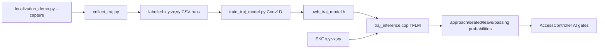
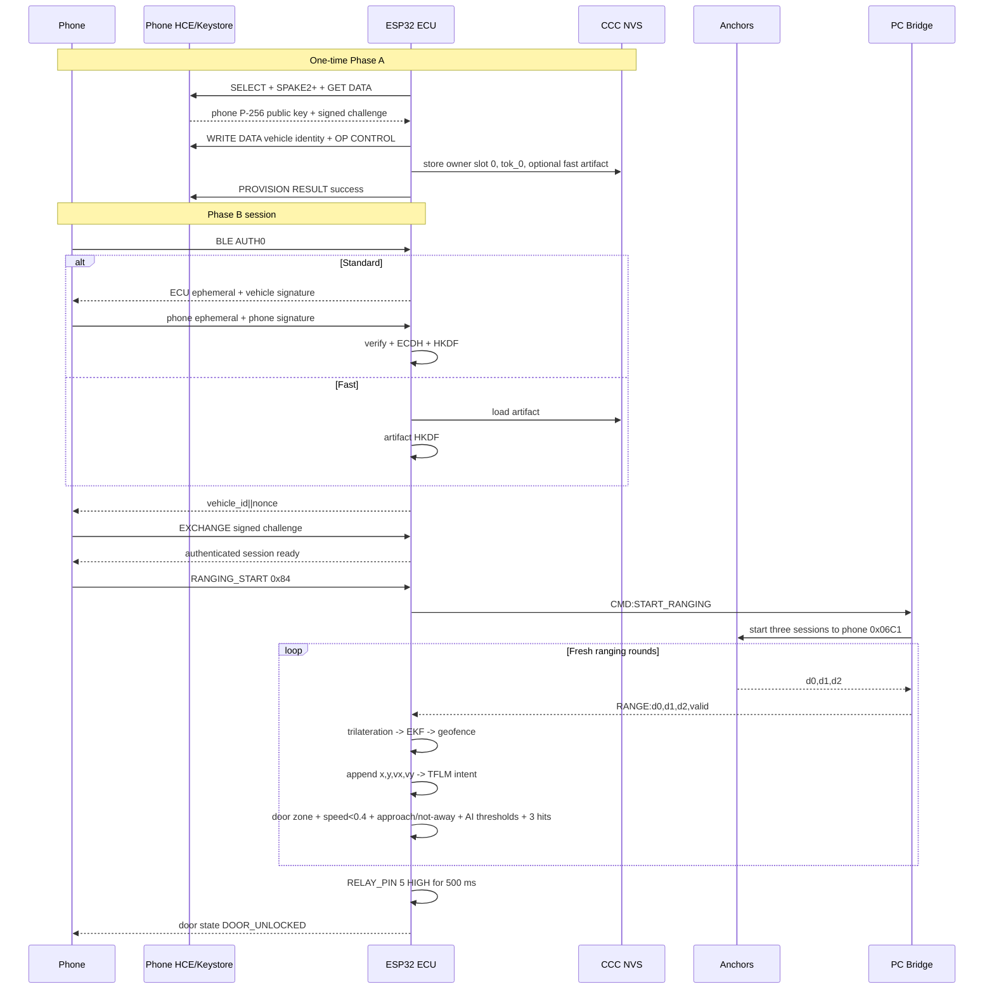

# Smart Car Access — System Architecture

## 1. Executive Summary

The phone domain combines Flutter orchestration for master-card intake, native Android HCE provisioning, BLE Phase-B authentication, background scanning and authentication, and Android multicast UWB ranging (`main.dart`, `master_card_provisioning.dart`, `ProvisioningHostApduService.kt`, `pke_auth_orchestrator.dart`, `pke_background_service.dart`, and `UwbMulticastBridge.kt`). The ranging domain uses phone/controller address `0x06C1` with three anchor sessions, while a PC bridge reads the anchor UARTs and relays `RANGE:d0=...,d1=...,d2=...,valid=...` frames to the ESP32-S3 over USB-CDC (`run_fira_bridge.py`). The ESP32 ECU runs Arduino and FreeRTOS firmware for NFC, BLE and FSM processing, UWB parsing, trilateration, 2D constant-velocity EKF tracking, TinyML intent inference, geofencing, and relay and ignition control (`platformio.ini`, `main.cpp`, `uwb_bridge.cpp`, and `access_controller.cpp`). Firebase Authentication identifies users, and Firestore stores cars, digital keys, provisioning metadata, access and anomaly history, and anomaly decisions, while immobilizer tokens and private keys remain outside the cloud data model (`auth.dart`, `car_service.dart`, `anomaly_detection_service.dart`, and `DATA_CONTRACTS.md`).

## 2. NFC Provisioning (Phase A)

Phase A selects HCE AID `A000000809434343444B467631` with `00 A4 04 00`, then executes SPAKE2+ REQUEST `INS=0x30`, SPAKE2+ VERIFY `INS=0x32`, base GET DATA `INS=0xCA,Lc=0`, WRITE DATA `INS=0xD4`, signature GET DATA `INS=0xCA,Lc=24`, OP CONTROL `INS=0x3C,P1=0x11`, and PROVISION RESULT `INS=0xDA,data=0x01` (`nfc_session.cpp` and `ProvisioningHostApduService.kt`). The SPAKE2+ challenge is `vehicle_id[8] || random_nonce[16]`: REQUEST transports it in TLV `0x50`, and VERIFY returns TLV `0x58` with a 32-byte HMAC-SHA256 that the ECU checks against the master secret (`nfc_session.cpp`). Base GET DATA parses `[keyIdLen][keyId][phone_pub_65][certLen_be16][cert]` with optional fast-artifact TLVs `0x90` for the version and `0x91` for the 32-byte key, whereas WRITE DATA sends TLV `0x80,len=8,vehicle_id` and TLV `0x81,len=65,vehicle_pub`, and the signature response contains `[sigLen_be16][ECDSA-P256 DER signature]` (`nfc_session.cpp`). The CCC mailbox uses NVS namespace `ccc_dk`, identity and bookkeeping keys `v_id`, `v_pub`, `v_priv`, `sig_bmp`, and `slot_bmp`, and eight slots whose `ep_0`..`ep_7` values hold 65-byte endpoint public keys and whose `tok_0`..`tok_7` values hold 32-byte immobilizer tokens; slot 0 is the owner and slots 1–7 are friends (`ccc_mailbox.cpp` and `ccc_mailbox.h`). The same namespace stores provisioning keys `cert_chain`, `fast_art_ver`, `fast_art_key`, `force_prov`, and `oneshot_force`; successful owner provisioning writes the phone key to slot 0, activates it, generates `tok_0`, clears signaling bit `0x0001`, and rejects replacement unless force mode is active (`provisioning_phase.cpp`). Android protects the phone identity under alias `smart_car_phone_identity_p256` in `AndroidKeyStore` as an EC `secp256r1` key with SHA-256 sign/verify purposes and no user-authentication requirement, allowing the HCE service to sign while operating in the background (`KeystoreBridge.kt`).



## 3. BLE Authentication (Phase B)

Phase B uses GATT service `0000aaaa-1234-5678-9abc-def012345678`, RX write characteristic `0000aac1-1234-5678-9abc-def012345678`, and TX read/notify characteristic `0000aac2-1234-5678-9abc-def012345678` as an APDU-like tunnel for AUTH0 `0x80`, AUTH1 `0x81`, EXCHANGE `0x82`, CONTROL_FLOW `0x83`, RANGING_START `0x84`, and RANGING_STOP `0x85` (`ble_auth.cpp`). In the standard path, AUTH0 uses `P1=0x11`; the ECU generates a P-256 ephemeral pair, returns the 65-byte public key, sends `[ecu_ephemeral_pub_65][vehicle_sig_len_le16][vehicle_ECDSA_DER]`, and verifies the phone response `[phone_ephemeral_pub_65][phone_sig_len_le16][phone_ECDSA_DER]` with the provisioned endpoint key (`ble_auth.cpp`). A 32-byte P-256 ECDH secret feeds HKDF-SHA256 with an empty salt: ENC info is `16-byte("SmartCarv1|ENC" + zero padding) || ecu_ephemeral_pub_65 || phone_ephemeral_pub_65`, MAC info replaces the label with `SmartCarv1|MAC`, and both outputs are 32 bytes (`ble_auth.cpp`). The ECU then publishes `vehicle_id[8] || nonce[16]`, and the phone returns its signature through EXCHANGE so that the ECU can verify the 24-byte challenge before declaring the session ready (`ble_auth.cpp`). The fast transaction instead uses AUTH0 `P1=0x01` with the requested artifact version; if rollout policy permits it and NVS contains a matching 32-byte artifact, the ECU skips AUTH1/ECDH and derives 32-byte ENC and MAC keys from empty-salt HKDF info `16-byte("SmartCarFast|ENC" or "SmartCarFast|MAC", zero-padded) || vehicle_id[8] || artifact_version[1]`, after which it returns the 24-byte challenge directly (`ble_auth.cpp` and `platformio.ini`). CONTROL_FLOW requires ready session keys and raises the FSM unlock-request event, while RANGING_START and RANGING_STOP likewise require a ready session and invoke `UwbBridge::sendStart()` and `UwbBridge::sendStop()` (`ble_auth.cpp`).

```mermaid
sequenceDiagram
  participant Phone
  participant ECU
  participant NVS
  Phone->>ECU: Connect GATT
  alt Standard path P1=0x11
    Phone->>ECU: AUTH0 0x80
    ECU-->>Phone: ECU ephemeral P-256 public key
    ECU-->>Phone: AUTH1 0x81, ECU ephemeral + vehicle signature
    Phone->>ECU: AUTH1 0x81, phone ephemeral + phone signature
    ECU->>NVS: load provisioned phone public key
    ECU->>ECU: verify signature, ECDH, HKDF ENC/MAC
  else Fast path P1=0x01
    Phone->>ECU: AUTH0 0x80, artifact version
    ECU->>NVS: load matching 32-byte fast artifact
    ECU->>ECU: HKDF fast ENC/MAC; skip AUTH1/ECDH
  end
  ECU-->>Phone: 24-byte vehicle_id||nonce challenge
  Phone->>ECU: EXCHANGE 0x82, signed challenge
  ECU->>ECU: verify with provisioned phone key
  ECU-->>Phone: EXCHANGE 9000; session ready
  Phone->>ECU: CONTROL_FLOW 0x83
  ECU-->>Phone: CONTROL_FLOW 9000
  Phone->>ECU: RANGING_START 0x84
  ECU-->>Phone: 9000
```

## 4. UWB Localization Pipeline

The localization topology uses phone/controller address `0x06C1` with three anchors and per-anchor PC UART clients, commonly ordered as COM11/COM19/COM12 for d0 rear-centre, d1 right, and d2 left B-pillar, and forwards `RANGE:d0=<m>,d1=<m>,d2=<m>,valid=<0|1>` over ESP32 USB-CDC (`run_fira_bridge.py` and `uwb_geometry.h`). The PC bridge starts or stops all anchor sessions on `CMD:START_RANGING` or `CMD:STOP_RANGING` and returns corresponding `ACK:` lines, while the ESP32 derives `valid_mask` from each positive distance rather than the aggregate `valid` field so that two-anchor solutions remain possible (`run_fira_bridge.py` and `uwb_bridge.cpp`). Trilateration applies a two-circle closed-form solution when exactly two anchors are usable and a maximum-10-iteration Gauss-Newton least-squares refinement when all three are usable, producing `(x,y,rms,valid)` (`trilateration.cpp` and `trilateration.h`). Anchors (uwb_geometry.h): A0=(0.00,-2.00)m rear-centre, A1=(0.95,0.00)m right, A2=(-0.95,0.00)m left B-pillar. EKF: 2D constant-velocity [x,y,vx,vy]; sigma_meas=clamp(RMS,0.05,1.0)m; sigma_a=1.2 m/s^2; predict per measurement; NO coasting; re-init if gap>2s or innovation>2.5m. The EKF additionally uses a default measurement standard deviation of 0.15 m, initial velocity variance 4.0 `(m/s)^2`, and a 2.0 m/s speed clamp; `kDrivePeriodMs=100` drives inference and access from the last corrected estimate, whereas `kMaxCoastMs=500` suppresses stale access updates without introducing prediction between measurements (`ekf_stub.cpp` and `uwb_bridge.cpp`).



## 5. Access Control & Geofencing

Geofence zones: OUTSIDE / WELCOME r=2.5m / DRIVER_DOOR centre(-0.95,0) r=1.0m / DRIVER_SEAT centre(-0.35,0) r=0.45m. Classification checks DRIVER_SEAT before DRIVER_DOOR, WELCOME, and OUTSIDE, and the stateful result changes only after three consecutive samples of a candidate zone (`geofence.cpp`, `geofence.h`, and `access_controller.cpp`). AccessController: 3 states LOCKED->DOOR_UNLOCKED->OCCUPIED->LOCKED; gates: deceleration (speed<0.4m/s), 3-hit unlock debounce, 3s seat-settle, radial-velocity approach, 4-class AI intent. From LOCKED, unlocking additionally requires a DRIVER_DOOR or DRIVER_SEAT zone, radial velocity not moving away above `0.10 m/s`, passing probability below `0.70`, approach probability at least `0.80`, and all conditions sustained for three hits; from DOOR_UNLOCKED, DRIVER_SEAT, speed below `0.4 m/s`, seated probability at least `0.80`, and a continuous 3000 ms settle cause the door to lock and ignition to become authorized (`access_controller.cpp`). DOOR_UNLOCKED returns directly to LOCKED when the stable zone becomes OUTSIDE while moving away above `0.10 m/s`, without leave debounce or a leave-intent threshold, whereas OCCUPIED requires OUTSIDE, the same moving-away condition, leave probability at least `0.80`, and three consecutive hits before revoking ignition and locking; if inference is unavailable or its 25-frame window is warming up, approach, seated, and leave default to `1.0` and passing defaults to `0.0` so that AI gates are skipped (`access_controller.cpp` and `uwb_bridge.cpp`). RELAY_PIN=5, IGNITION_PIN=7; an unlock holds the relay HIGH for 500 ms before returning it LOW, while authorized ignition is represented by a HIGH output (`access_controller.cpp` and `access_controller.h`).



## 6. Intent Recognition (TinyML)

The data pipeline begins when `localization_demo.py --capture` records ESP32 output, after which `collect_traj.py` extracts labelled `[EKF]` rows in the form `run_id,timestamp_ms,x,y,vx,vy,label`; `train_traj_model.py` trains and converts the model, `uwb_traj_model.h` embeds its bytes, and `traj_inference.cpp` executes it with TensorFlow Lite Micro. Train/test separation occurs by run, StandardScaler is fitted only to training features, and sliding windows do not cross run boundaries (`collect_traj.py` and `train_traj_model.py`). The model is Conv1D(16,kernel=3,ReLU) -> MaxPool(2) -> Conv1D(32,kernel=3,ReLU) -> MaxPool(2) -> Flatten -> Dense(16,ReLU) -> Dropout(0.2) -> Dense(4,softmax) (`train_traj_model.py`). Intent: TFLM Conv1D, 25x4 window [x,y,vx,vy], 4 classes approach(0)/seated(1)/leave(2)/passing(3); act if p>=0.80; hard-block unlock if p_passing>=0.70; already wired in uwb_bridge.cpp. Feature normalization uses mean `[-1.176990,-0.693135,-0.019802,0.006809]` and scale `[1.118417,1.425282,0.187332,0.270498]` in `[x,y,vx,vy]` order (`traj_inference.h`). TFLM allocates a 44 KiB tensor arena, requires float32 input and output tensors, and withholds predictions until all 25 frames are available, preventing partially populated sequences from controlling the state machine (`traj_inference.cpp`).



## 7. Mobile App Architecture

The Flutter service layer separates cloud and user functions across `auth.dart`, `car_service.dart`, `database.dart`, `initial_data_helper.dart`, and `language_service.dart`: these modules wrap Firebase Authentication, car and digital-key CRUD plus owner-provisioning and simulated control updates, writes to `User/{userId}`, sample car/key seeding with UI feedback, and persisted localization preferences, respectively. Its security and access services include `master_card_provisioning.dart` for NDEF JSON intake and native HCE session/binding control; the disabled compatibility stub `nfc_provisioning_service.dart`; `pke_auth_orchestrator.dart` for FlutterBluePlus scanning, connection, standard or fast Phase B, session keys, GPS, and ranging commands; `ble_phase_test.dart` for Phase-A status and delegated Phase-B tests; `ble_runtime_permissions.dart` for Android permission handling; and `gps_service.dart` for GPS acquisition, reverse geocoding, 32-byte serialization, XOR encryption, and HMAC-SHA256 (`master_card_provisioning.dart`, `nfc_provisioning_service.dart`, `pke_auth_orchestrator.dart`, `ble_phase_test.dart`, `ble_runtime_permissions.dart`, and `gps_service.dart`). Runtime support is divided among `pke_background_service.dart`, which performs foreground-mode Android scanning, authentication, telemetry/backoff, and dual-isolate handoff; `background_service_control.dart`, which persists and toggles service state; `doze_exemption_service.dart`, which manages battery-optimization exemption; `pke_rollout_flags.dart`, which persists background, fast-transaction, bonding, and RSSI policy; `pke_telemetry.dart`, which defines structured PKE events; and `uwb_multi_service.dart`, which wraps the native multicast UWB MethodChannel and EventChannel (`pke_background_service.dart`, `background_service_control.dart`, `doze_exemption_service.dart`, `pke_rollout_flags.dart`, `pke_telemetry.dart`, and `uwb_multi_service.dart`). The anomaly and notification layer comprises `ai_service.dart`, `anomaly_scorer.dart`, `anomaly_detection_service.dart`, `anomaly_decision_engine.dart`, `time_anomaly_detector.dart`, `location_anomaly_detector.dart`, `notification_service.dart`, and `push_notification_service.dart`, covering risk features, Gemini-backed scoring and fallback, deterministic and AI analyses, decision mapping, temporal/frequency and geographic detectors, in-app dialogs, and system notifications. Native Kotlin modules assign HCE APDU handling to `ProvisioningHostApduService`, UID/vehicle/artifact persistence to `DataStoreUtil`, the Phase-A P-256 identity to `KeystoreBridge`, Flutter-accessible Phase-B cryptography to `HandshakeChannel` and `PhaseBCrypto`, and API-36 `android.ranging` multicast DS-TWR with aggregate status/range events to `UwbMulticastBridge` (`ProvisioningHostApduService.kt`, `DataStoreUtil.kt`, `KeystoreBridge.kt`, `HandshakeChannel.kt`, `PhaseBCrypto.kt`, and `UwbMulticastBridge.kt`). During the dual-isolate handoff, the background isolate authenticates and retains BLE while invoking `runUwbHandoff`; the foreground isolate reconnects by known MAC, sends RANGING_START, starts native multicast UWB, returns `uwbHandoffResult`, and allows the background connection to be released, with `stopUwbHandoff` and `uwbHandoffStopped` reversing the process; supporting dependencies are `nfc_manager` 4.1.1 with local override, `flutter_blue_plus` 1.18.5, `pointycastle` 3.9.0, `asn1lib` 1.5.0, `crypto` 3.0.3, `cryptography` 2.7.0, `flutter_secure_storage` 9.2.2, `shared_preferences` 2.3.2, `permission_handler` 11.3.1, `wakelock_plus` 1.2.5, `geolocator` 13.0.2, `flutter_background_service` 5.1.0, `flutter_background_service_android` 6.3.0, and local `phaseb_handshake_bridge` (`pke_background_service.dart` and `pubspec.yaml`).

## 8. Cloud & Anomaly Detection

Firestore `cars/{carId}` stores owner-controlled car state and an `ownerProvisioning` object containing `vehicle_id`, `owner_uid`, `device_pub_key`, `vehicle_pub_key`, status, slot-0 owner metadata, and optional write-data and scanned-vehicle fields, while `Vehicles/{vehicleIdHex}` receives a best-effort mirror (`car_service.dart`). The `digital_keys/{keyId}` collection stores owner ID, car ID, name, type, status, permissions, validity, and timestamps; user records use the code-authoritative path `User/{userId}`, rather than the documented `users/{uid}` path (`car_service.dart` and `database.dart`). The `access_logs/{id}` history supports time, frequency, and location analysis, `anomaly_analysis/{id}` stores deterministic analysis details, and `anomaly_decisions/{id}` stores AI-enriched decisions (`time_anomaly_detector.dart`, `location_anomaly_detector.dart`, and `anomaly_detection_service.dart`). In the deterministic path, `AnomalyDetectionService` invokes `TimeAnomalyDetector` and `LocationAnomalyDetector`, the time detector evaluates one-hour frequency, and their confidence values are summed and logged; in the AI path, time, location, and frequency features flow through `AnomalyScorer` to `AIService` with respective weights of 30%, 30%, and 40% and a rule-based fallback (`anomaly_detection_service.dart`, `time_anomaly_detector.dart`, `location_anomaly_detector.dart`, `anomaly_scorer.dart`, and `ai_service.dart`). `AIService` calls `gemini-2.5-flash-lite:generateContent`, parses JSON from the first candidate, and falls back when HTTP or parsing fails, while the otherwise uninvoked `AnomalyDecisionEngine.processDecision` maps confidence `<=0.60` to LOW/ALLOW, `<=0.85` to MEDIUM/CONFIRM, and `>0.85` to HIGH/BLOCK (`ai_service.dart` and `anomaly_decision_engine.dart`). GPS synchronization uses a code-authoritative 32-byte little-endian plaintext of latitude float64, longitude float64, altitude float32, accuracy float32, and timestamp int64 milliseconds; the phone XORs it with the 32-byte session ENC key and appends HMAC-SHA256 over the ciphertext with the 32-byte session MAC key, yielding a 64-byte packet and overriding the stale documented lon/lat/alt le32, accuracy u16, and timestamp u32 layout (`gps_service.dart` and `ble_auth.cpp`).

## 9. FreeRTOS Runtime & Data Contracts

The FreeRTOS runtime creates `FSM` on core 1 with priority 6 and an 8192-byte stack to call `FSM::tick()` every 1 ms, `NFC` on core 1 with priority 4 and an 8192-byte stack to call `NfcSession::tick()` every 2 ms, and `UWB` on core 1 with priority 5 and a 20480-byte stack to read USB-CDC RANGE/ACK lines, execute `UwbBridge::tick()` and `AccessController::tick()`, and delay 5 ms (`main.cpp`). The Arduino `loop()` independently services `BLEMod::tick()` every 50 ms, keeping BLE maintenance separate from the three explicit tasks (`main.cpp`). Each `RangingFrame` contains `uint32_t t_ms`, `double d[3]`, and `uint8_t valid_mask`, whose bit i records whether d[i] is fresh and in bounds after parsing; the serial boundary accepts `RANGE:d0=...,d1=...,d2=...,valid=...` and `ACK:...` from the PC and emits `CMD:START_RANGING` or `CMD:STOP_RANGING` from the ECU (`ranging_frame.h`, `uwb_bridge.cpp`, and `run_fira_bridge.py`). The EKF maintains private state `g_x[4]=[px,py,vx,vy]`, covariance `g_P[4][4]`, and timestamps `g_lastMs` and `g_lastMeasMs`, while `Geofence::Zone` assigns the implicit values `OUTSIDE=0`, `WELCOME=1`, `DRIVER_DOOR=2`, and `DRIVER_SEAT=3` (`ekf_stub.cpp` and `geofence.h`). The BLE boundary uses request frames `[CLA,INS,P1,P2,Lc,data...]` and emits responses through the TX notify characteristic with the originating instruction, response status, and any data, providing a single transport contract for authentication and ranging commands (`ble_auth.cpp`).

## 10. Key Constants Table

The following constants define the geometry, estimator, access policy, protocol, and runtime parameters used by the implementation. Values are reproduced directly from the structured code extraction without substituting documentation-era settings. The source column identifies the implementation file in which each constant is defined.

| Constant | Value | Source file |
|----------|-------|-------------|
| `kAnchorX/Y` (A0/A1/A2) | `(0,-2)/(0.95,0)/(-0.95,0)` m | `uwb_geometry.h` |
| `kDoorX/kDoorY/kDoorRadiusM` | `-0.95 / 0.0 / 1.0` | `geofence.h` |
| `kSeatX/kSeatY/kSeatRadiusM` | `-0.35 / 0.0 / 0.45` | `geofence.h` |
| `kWelcomeRadiusM` | `2.5` | `geofence.h` |
| `RELAY_PIN / IGNITION_PIN` | `5 / 7` | `access_controller.h` |
| `STILL_SPEED_MPS` | `0.4` | `access_controller.h` |
| `REQUIRED_CONSECUTIVE_HITS` | `3` | `access_controller.h` |
| `SEAT_SETTLE_MS` | `3000` | `access_controller.h` |
| `LEAVE_CONSECUTIVE_HITS` | `3` | `access_controller.h` |
| `APPROACH_SPEED_MIN_MPS` | `0.10` | `access_controller.h` |
| `RELAY_PULSE_MS` | `500` | `access_controller.h` |
| `INTENT_APPROACH/SEATED/LEAVE_THRESHOLD` | `0.80` | `access_controller.h` |
| `INTENT_PASSING_BLOCK` | `0.70` | `access_controller.h` |
| `kAccelStd` (EKF) | `1.2 m/s^2` | `ekf_stub.cpp` |
| EKF meas-noise clamp | `0.05–1.0 m` | `ekf_stub.cpp` |
| `kDefaultMeasStd / kInitVelVar / kNominalDtS` | `0.15 m / 4.0 (m/s)^2 / 0.10 s` | `ekf_stub.cpp` |
| `kMaxGapS / kMaxInnovationM / kMaxSpeedMps` | `2.0 s / 2.5 m / 2.0 m/s` | `ekf_stub.cpp` |
| `kDrivePeriodMs / kMaxCoastMs` | `100 / 500 ms` | `uwb_bridge.cpp` |
| UWB frame queue depth | `8` | `uwb_bridge.cpp` |
| `TIME_STEPS / NUM_FEATURES / NUM_CLASSES` | `25 / 4 / 4` | `traj_inference.h` |
| TFLM tensor arena | `44 * 1024 bytes` | `traj_inference.cpp` |
| Scaler mean | `[-1.176990,-0.693135,-0.019802,0.006809]` | `traj_inference.h` |
| Scaler scale | `[1.118417,1.425282,0.187332,0.270498]` | `traj_inference.h` |
| AUTH service / RX / TX UUID | `0000aaaa...5678 / 0000aac1...5678 / 0000aac2...5678` | `ble_auth.cpp` |
| AUTH0 standard / fast P1 | `0x11 / 0x01` | `ble_auth.cpp` |
| AUTH0/AUTH1/EXCHANGE/CONTROL/RANGING_START/RANGING_STOP | `0x80/0x81/0x82/0x83/0x84/0x85` | `ble_auth.cpp` |
| HCE AID | `A000000809434343444B467631` | `ProvisioningHostApduService.kt` |
| `SPAKE2_CHALLENGE_TTL_MS` | `45000 ms` | `ProvisioningHostApduService.kt` |
| CCC maximum slots | `8` | `ccc_mailbox.cpp` |
| Phase-A challenge | `8-byte vehicle ID + 16-byte nonce = 24 bytes` | `nfc_session.cpp` |
| PC bridge destination/session/channel/preamble | `0x06C1 / 42 / 9 / 9` | `run_fira_bridge.py` |
| PC bridge rate/freshness/distance bounds | `10 Hz / 500 ms / 0.1–30.0 m` | `run_fira_bridge.py` |
| FSM event queue | `16` | `fsm.cpp` |
| NFC UART RX/TX/baud | `44 / 43 / 115200` | `main.cpp` |

## 11. End-to-End Unlock Sequence

The end-to-end path begins with one-time NFC provisioning, which binds the phone P-256 identity, vehicle identity, owner slot, immobilizer token, and optional fast artifact before BLE authentication is permitted. A standard ECDH/HKDF or artifact-based fast Phase-B exchange establishes authenticated session keys, after which RANGING_START activates the three-anchor pipeline and the ESP32 processes range frames through trilateration, the no-coasting EKF, geofencing, and TFLM intent inference. When the driver-door geometry, speed, radial approach, intent thresholds, and three-hit debounce all pass, the ECU drives RELAY_PIN 5 HIGH for 500 ms and enters DOOR_UNLOCKED.


